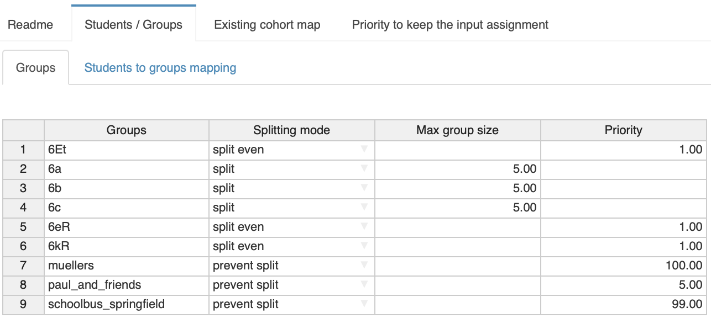

# Cohort Assignment Problem for School in Corona Times

The current Corona pandemic is posing major challenges for society as a whole. Since in schools a large number of students are in enclosed spaces, there is a fear that clusters of infection will form here. One way to reduce the risk of infection is to use so-called cohort strategies, i.e., dividing classes into smaller groups that are taught separately. As [a simulation study](https://www.medrxiv.org/content/10.1101/2020.11.30.20241166v1) has shown, cohort divisions in which contacts are not separated across cohorts whenever possible can reduce infections by over 70%. However, partitioning is not a simple problem. While it may still be possible to determine an optimal division by hand for small classes with few students, this approach has limitations in practice: There are usually cross-class courses, so individual classes cannot be considered in isolation.

This Cohort Divisor MIRO app has been inspired by the excellent work [Corona-Schuleinteilung](https://www.mathematik.uni-kl.de/opt/corona-schuleinteilung/) (in German) by [AG Opt](https://www.mathematik.uni-kl.de/opt/) at University of Kaiserslautern.

The fundamental concept of the Cohort divisor are *groups*. A group can consist of the students of a class or a course. Moreover, students from the same village sharing a bus ride, siblings, or friends can form a group. For each group the user needs to specify how the group should be handled by Cohort Divisor. For example, students of a class have to be divided that no more than a certain number are placed in the same cohort. However, if there are very few students in a group, it may not be divided at all. For example, sibling groups should not be split up if possible. The Cohort Divisor has the following group *modes*:

-   Split: The group will be split and each half cannot exceed a given maximum size

-   Split even: The group will be split and each half shall have the same number of students

-   Prevent split: If possible do not split the group, but if required keep the enrollment of the smaller part as small as possible

In different inputs to the Cohort Divisor are straight forward and are Excel like:

-   Information about the groups. The groups with mode "split" require a maximum size while the other groups require a "priority". The priority (usually between 1 and 99) is a measure for how important it is to split evenly or prevent a split. The larger the priority value the higher the priority to achieve the goal is. The priority of 100 for "prevent split" groups will make the Cohort Divisor work very hard to keep the group in one cohort.

-   Information about the students in the group: A simple group-student list is required to know about the enrollment of students in the various groups. Obviously, a student can be present in many groups.

-   The Cohort Divisor can also take an existing cohort assignment into account and can try to stay close to this existing assignment. This is especially useful if the cohort Divisor is repeated applied over a time horizon and one does not want to have too much change of already published cohort assignments. For the Cohort Divisor tab "Existing cohort map" shows the preexisting cohort division and allows via drag-and-drop to manually change the existing cohort assignments. The user can also apply a filter to only show the cohort division for students in selected groups:

The priority for keeping close to an existing cohort assignment that competes with the priorities for prevent a split and achieving an even split can be set in the "Priority to keep the existing cohort map" tab with a priority slider:

A priority of 0 means that the existing cohort assignment is not taken into account at all and the Cohort Divisor starts from scratch.

When the input is satisfactory, the user needs to start the optimization that is at the heart of the Cohort Divisor by pressing the "Solve model" button:

Some optimization log will fly by and after that is done the result of the Cohort Divisor will be shown:

This assignment can now be moved to the input tab "Existing cohort map" by clicking the arrow in the top right corner and the process can be repeated. There is also a group report in the tab "Report on groups" and one on cohorts in the tab "Report on cohort".

## Import and Export of data

Entering all the group and student information is a tedious task and the information (potentially anonymized) is already present in some Excel workbooks. The MIRO Cohort Divisor can import the data from an Excel workbook. The structure of such a workbook needs to be recognizable by the application and hence it is probably best to start with a workbook containing sample data which you can find [here](https://www.gams.com/blog/2021/03/a-cohort-divisor-application-for-schools/Cohort_Assignment_EN.xlsx).

1.  Open the workbook in Excel and enter/copy your data into the sheets "Group Info" and "Group Assignment". If a cohort division already exists that is to be improved by the application, the division can be entered in the "Existing Cohorts" sheet.

> Start the data exactly where the example data started. Blank lines can throw off the importer. In the individual Excel sheets you will find more information about the data format and contents.

2.  In the application import the Excel workbook by clicking on "Load data" in the left panel, browsing for the Excel file, and clicking load:

Now you should see your data in the input tabs.

If you repeat the exporting process after the Cohort Divisor "solved the model" the output is available in the sheet "studentgroupcohort (Output)". One can add an Excel filter an filter in the column B (header "gc" for "A" and "B") to get the student assignment to the cohorts. Alternatively, one can export the data in the "student assignment" output tab by clicking the "Download CSV" button:

This will export the current view into a CSV file which can also be opened with Excel and will look as follows:

Stay safe!
