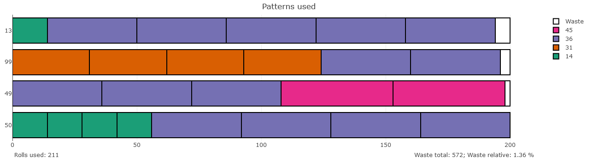

# Cutting Stock Problem
The cutting stock problem has its origins in the paper industry. A manufacturer has to satisfy the demand for paper rolls of different widths. For this purpose, smaller rolls are cut from wide paper rolls of standardized size. Depending on the pattern, it is not always possible to use the entire paper roll, so there will be waste. The objective is to meet the demand while minimizing the required number of paper rolls.

### Data:
Two input parameters are available.
1. Raw width: The standardized width of the paper roll from which patterns are cut.
2. Demand: The number that each width is demanded, e.g.:

| Width &nbsp;&nbsp;         | Demand          |
| :-------------: | :-------------: |
| 14          | 211              |
| 31          | 395             |
| 36          | 610             |
| 45          | 97               |

### Model Formulation:

__Sets__
$I$ = Widths
$P$ = Patterns

__Parameters__
$d_i$ = Demand of width $i$
$a_{i,p}$ = Number of width $i$ rolls cut in pattern $p$

__Decision Variables__
$xp_p$ = Number of Pattern $p$ used

We seek to minimize the number of patterns used while satisfying demand. The problem can be written as

$$ \min z = \sum_{p \in P} xp_{p} $$

subject to
$$ \sum_{p \in P} a_{i, p} x_p  \geq  d_i&nbsp;&nbsp;&nbsp;&nbsp;\forall i \in I $$

### Results:
The output tab 'Patterns used' shows the different patterns and the quantity used. Equal paper roll widths are shown in the same color. The waste is shown in white. In the following example, pattern 2, consisting of 4 paper rolls of width 31 and 2 paper rolls of width 36 with a waste of 3, is cut a total of 49 times.

<picture>
  <source srcset="static_cutstock/readme_output_dark.png" media="(prefers-color-scheme: dark)">
  
</picture>
