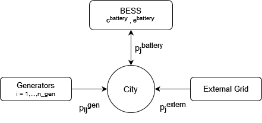

# A Battery Energy Storage System (BESS) sizing problem

This model is based on an example from [NAG](https://nag.com/), which can be found on their GitHub repository: [BESS.ipynb](https://github.com/numericalalgorithmsgroup/NAGPythonExamples/blob/master/local_optimization/MILP/BESS_MILP.ipynb). If you are interested in building your own MIRO application, there is a step-by-step tutorial for this application [here](https://www.gams.com/miro/step_by_step_tutorial.html).

## Model

  

A city has a certain energy demand for each hour. Given multiple energy sources, the goal is to schedule them in the most cost-effective way. The city can buy power from an external grid or from a number of generators. Additionally, it is often cheaper to purchase energy during off-peak hours (when prices are lower) and store it for later use. A Battery Energy Storage System (BESS) accomplishes this by charging when demand (and cost) is low and discharging when demand is high. The model simultaneously decides which energy source to use in each hour and determines which BESS size (storage and delivery rate) results in the lowest overall cost.

### Sets:
$i=$ generators, $j =$ hours, $t =$ alias of $j$

### Decision Variables:
####BESS Variables
$p_j^{battery} \doteq$ power charged or discharged from the battery at hour $j$

$c^{battery} \doteq$ power rate of the BESS (how much can the battery maximal deliver in one hour)

$e^{battery} \doteq$ energy rate of the BESS (how much can the battery maximal store)

#### Generator Variables
$p_{ij}^{gen} \doteq$ dispatched power of generator $i$ at hour $j$  ($p_{ij}^{gen}\geq 0$)

$s_{ij} \doteq$ binary variable stating if generator $i$ is active at hour $j$ ($=1$ online, $=0$ offline)

#### External Grid Variables
$p_j^{extern} \doteq$ from the external grid imported power at hour $j$

### Given Data (Parameters):
Since the size of the BESS is being optimized, we need to define the cost of increasing the battery delivery rate ($cost\_bat\_power$) and its storage capacity ($cost\_bat\_energy$).

The generators must be specified. To keep the model simpler, each generator’s cost is calculated using a linear function:
$$cost_i(p_{ij}^{gen}) = a_i \cdot p_{ij}^{gen} + b_i$$

where $a_i$ is the cost per unit of the generator $i$ and $b_i$ is the fixed cost.

When a generator is active, it must stay within its minimum and maximum power outputs, $pl_i$ and $pu_i$. Additionally, each generator has a minimum uptime $ut_i$ and a minimum downtime $dt_i$.

Depending on the time of the day, there are different prices for importing power from the external grid: $cost\_import\_power_j$. There is also a limit to the amount of energy that can be imported from the external grid per hour: $max\_input\_external\_grid$.

Finally, the city’s load $load\_balance_j$ must be met every hour $j$.

### Constraints:
Load Balance:
$$\sum_i p_{ij}^{gen} + p_j^{battery}  + p_j^{extern} = load\_balance_j \quad \forall j.$$

Generator Limits:
$$pl_i \cdot s_{ij} \le p_{ij}^{gen} \le pu_i \cdot s_{ij}  \quad \forall i,j.$$

Generator Uptime and Downtime:
$$ \sum _{t=j}^{j+ut_i-1} s_{it} \ge ut_i \cdot (s_{ij} - s_{ij-1})  \quad \forall i,j,$$

$$ \sum _{t=j}^{j+dt_i-1}(1- s_{it}) \ge dt_i \cdot (s_{ij-1} - s_{ij}) \quad \forall i,j.$$

Battery Power Constraints:
$$-c^{battery} \le p_j^{battery} \le c^{battery}  \quad \forall j.$$

Battery Energy Constraints:
$$-e^{battery} \le \sum_{j=0}^{t}  p_j^{battery} \le 0  \quad \forall t.$$

External Grid Power Limit:
$$0 \le p_j^{extern} \le max\_input\_external\_grid  \quad \forall j.$$

### Objective Function:
Minimize the total cost, which includes the cost of power from generators, the external grid, and the BESS:

$$\min \sum_j \sum_i cost_i(p_{ij}^{gen}) + \sum_j cost\_import\_power_j \cdotp p_j^{extern} + cost\_bat\_power \cdot  c^{battery} + cost\_bat\_energy \cdot e^{battery}$$
