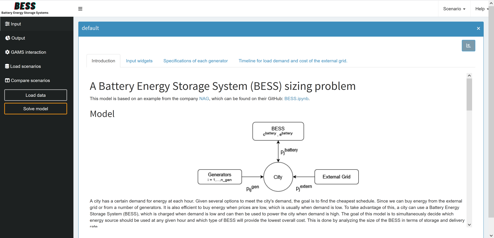
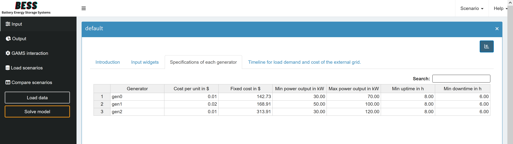
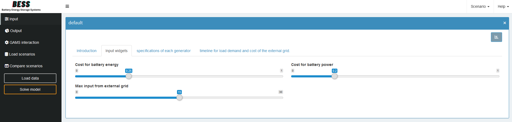
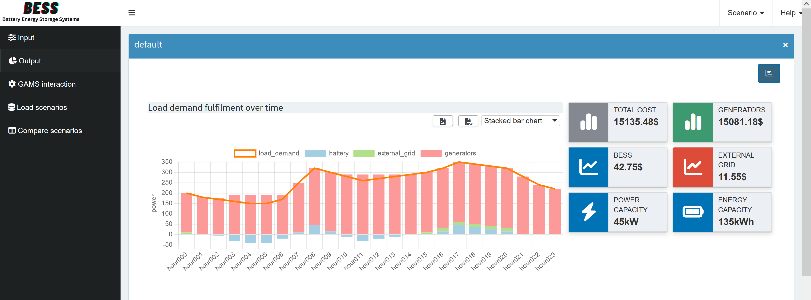

# From GAMSPy Model to MIRO App

In this tutorial we will have a look at the many features MIRO offers to generate an application for your optimization problem. This can be done starting with either a GAMS or GAMSPy implementation of your model. In this tutorial we will start with a GAMSPy model, where we will first have to define the input and output of our application. Note that except for the first section where we go through the changes in the model, there is no difference for the MIRO configuration depending on whether you use GAMS or GAMSPy as the modelling language. Then we will look at the visualization options that you can use directly, based only on these input/output definitions. This can already be helpful when implementing the model, as you can quickly plot the output data and check that the results make sense. And if they do not add up, you have a good starting point for where to look for errors. Next we look at the configuration mode. Here you can add a lot of default configurations without having to touch any code. Since the configuration mode options are sometimes not enough, we will then look at adding some custom renderers and custom widgets. Finally, we will look at some more custom additions that you can add to your MIRO application.

## Implement the Model

First you need to implement the model you want to make an application for, using either GAMS or GAMSPy, as mentioned above we will be using GAMSPy. For instructions on what code changes you need to make in GAMS, see the documentation [LINK](https://www.gams.com/miro/model.html#model-adjustments). 

We will look at a "A Battery Energy Storage System (BESS) sizing problem".
This model aims to optimize a city's hourly energy schedule by selecting the most cost-effective combination of energy sources, including the use of a BESS to store low-cost energy during off-peak hours and release it during high-demand periods. By evaluating the storage capacity and discharge rate of various BESS options, the model identifies the configuration that minimizes overall energy costs while reliably meeting demand. We recommend that you have a quick look at the mathematical description in the README.md first, since we will use the variable names directly. 

**add the model code here so that people can follow along based on the model**

### Input

Let's start with the simpler inputs. As you can see, we have three scalar input parameters. For these we simply need to add the `is_miro_input=True` option to their parameter definitions.

CODE SNIPPET


For the generator specifications and the time schedule inputs we need to change a bit more. The model depends on two sets, one for the possible generators and one for the hours when the load demand should be met. Since these two sets are not fixed, but are to be part of the input, we first define the records with our default values. GAMS is domain driven, so for our multidimensional parameters we also need to specify all the necessary domains. This can be done either by using the [Universal Set](https://gamspy.readthedocs.io/en/latest/user/basics/set.html#the-universal-set-as-set-identifier) or by directly specifying all necessary domains, which is generally the preferred method. For a MIRO application, however, the second option is the **only** possible way, since if we want to use this multidimensional parameter as a table in MIRO, it is necessary to already know which columns the table will have. Therefore we define additional sets for the corresponding headers. As mentioned above, these header sets are the recommended way to handle multidimensional parameters in any GAMS/GAMSPy model.

Now for the additions to make these into MIRO inputs. First we need to set `is_miro_input=True` again. As we want them to be displayed as tables, we also set `is_miro_table=True`. Finally, the most important part, we need to set `domain_forwarding=[True, False]`. This means that we want the domain corresponding to our generator set to be forwarded so that the set elements are taken from the MIRO application. The headers are known and not part of the input, so we set the second element to False.

CODE SNIPPET


We have two parameters dependent on a given hour, `load_demand` and `cost_external_grid`, so to have a single source of truth wrt. the hour set we combine them into one parameter. Now we just need to make the same changes as for the generator specifications. 

In this example it is not necessary to do any further calculations based on the input values. But this could easily be done. An example of this can be seen in vrptw. Here we have longitude and latitude values as input, but our model needs the individual distances. So we simply define a new parameter that depends on our MIRO input. You can use any mathematical calculation allowed in Python for this!

**maybe mention that this also goes in custom renderer**

CODE SNIPPET

Given the input, we move on to the output.

### Output 

When implementing the model it is useful to set all variables to output with: `is_miro_output=True`. This way, after solving, you can quickly check what the calculated variable values are and possibly find any remaining errors in the model.

In general, you can make any variable or parameter an MIRO output. Sometimes it makes sense to define parameters as outputs depending on the variables. A simple example of this in our model would be to define individual parameters for the three cost factors we have. This way we can display these values directly in the MIRO application. 

CODE SNIPPET
```python
import os
# asd
```

In our example, we also want to combine the power variables with the load demand input into one output parameter. This will help us later to show directly that the sum of the powers equals the load demand.

CODE SNIPPET

**again add the full updated gamspy code**

Now you can launch MIRO and have your first version of a fully interactive modelling application!

**maybe link to miro download at the beginning or here?**

BASH SNIPPET

After starting MIRO, your application should look like this:

change this image to one without data
<div align="center">  </div>


## Rapid Prototyping

Now that we have our first MIRO application, let's see what kind of interaction we have right from the start. 

### Input

At first the input parameters are empty, if you click on *Load data* you have the option to load the default values specified by the records option in the GAMSPy code.

If the input parameters are correctly defined, you can now change the input and *Solve model* to obtain the solution for a different set of input values. 

Even at the input stage, it can sometimes be helpful to visualize the data to check for inconsistencies, e.g. that the load demand is never negative and should probably increase during the day and decrease at night, as should the cost of the external grid.

To do this you need to toggle the view in the top right corner by clicking on the three lines **maybe add the icon**. Here you can filter, aggregate and pivot the data. It is also possible to directly use different chart types to visualize the data, this is done with [Pivot Table](https://www.gams.com/miro/charts.html#pivot-chart).

Here we pivoted the headers and selected line graphs. As the values for load_demand and cost_external_grid are not in the same dimension, the direct result is not very helpful as it appears that cost_external_grid is always zero. To make this clearer, we add a second y-axis. This is done by first setting the display type to *Line Chart* and then clicking on the **plus icon** to add a new view. Here you can go to the *Second Axis* tab and select which series to plot in relation to it. You can also add a title and label for the axis. When you are happy with the result, save the view and press the **table icon** to activate the [Presentation Mode](https://www.gams.com/miro/charts.html#presentation-mode).

You should end up with something like this:


<div align="center">  </div>


### Output

When implementing the model, the output is definitely more interesting than the input, so lets see what we can do here. 

For scalar output values, the visualization is very straightforward, simply displaying them in a table under a combined tap:

<div align="center">  </div>

But we can do a lot more with the pivot tool. We might be interested to see which generator provides how much of the total power at what time. To do this we simply go to our output variable which contains the power values of the generators. Here we simply pivot by generator and filter the level value. Then we just need to select the Stacked Bar Chart and we end up with this:

<div align="center">  </div>

Now we can go back and see that *gen0* is the cheapest generator, but it also has the smallest maximum power output, so it needs help to provide full load demand, and apparently, even though the fixed cost of *gen2* is almost double, the generator has to produce so much power that its cheaper unit cost outweighs this. So it checks out. We can also make sure that the minimum up and down times are met. Finally, we can check that each generator, if active, is always within its permitted limits. If we find that one of these constraints is not being met, we immediately know which constraint in the model code we need to take a second look at.


Let us look at another example. Remember that in the model we combined all the power values with our given load demand into one parameter. By looking at this, we can see if the load demand is actually being met and which source contributed to it at each hour. If we were to use the Stacked Bar Chart again, we would not be able to easily compare the amount of load demand with the sum of the power sources. To do this, we change the type again to Stacked Bar Chart and then click the **plus icon** to add a new view. Under the *Combo Chart* tab we can specify that we want the load demand to be displayed as a line chart and that it should not be included in the stack. You should end up with the following image:

<div align="center">  </div>


Here we can immediately see that the load demand is always exactly met. The only exception is when the BESS is being charged. We can see that the blue bar is always negative when the input power is higher than the load demand. This is another good check to see if all our constraints are met and if the results are logical.

You can do similar visualizations for the power from the battery and the external grid to check that their constraints are also being met. Hopefully you now have a better understanding of the powerful Pivot Tool and how to use it to check your implementation directly.

## Config Mode
Now that we have a better understanding of our model and are fairly confident that it satisfies all given constraints and provides a reasonable solution, we can begin to configure our application.

To do this, we will start our MIRO application in [config mode](https://www.gams.com/miro/customize.html).

BASH SNIPPET

You should land on this page:

INSERT IMAGE

The [config mode](https://www.gams.com/miro/customize.html) provides a lot of customization right out of the box, so we don't need to write any code directly for now. 

### General Settings 

Let's start with some general settings. We will give our application a title, add our own logo, add a README and enable loading the default scenario on startup. These are just a few of the possible options, if your company has a specific CSS style you could include it here as well. To see all possible options, see the [General settings](https://www.gams.com/miro/configuration_general.html) documentation.


<div align="center">  </div>

### Symbols

**add output value boxes**

Next, we will take a look at the [Symbols](https://www.gams.com/miro/configuration_symbols.html) section. Here we will first change our symbol aliases to make them sound more natural. Then, assuming that you are more likely to want to change the scalar values, we will change the order of the input. Finally, sometimes you need to define variables or parameters as output that you only need as additional data for some custom renderer (we will introduce custom renderers in the next section). If you have such output parameters, it makes sense to hide them so that they don't get their own tab on the output page.

<div align="center">  </div>

### Tables

In the [Tables](https://www.gams.com/miro/configuration_tables.html) sections you can customize the general configuration of input and output tables. We could apply these customizations to our input table, but it's not necessary in this case.

### Input Widgets

We have several inputs and we will customize them in the [Input Widgets](https://www.gams.com/miro/widgets.html) section. Let's take a look at our scalar inputs first. For these we can choose between slider, drop down menu, checkbox or numeric input. We will now set our inputs to sliders. If you don't want to impose any restrictions on the value (minimum, maximum and increment), you should stay with the numeric input. Just decide which option is best based on the type of input.

<div align="center">  </div>

For our multidimensional inputs we only have tables as an option directly in configuration mode. Here we can choose between three different types. We will stay with the default table for our two inputs. Since we don't have large datasets and, at least at the moment, don't plan to do a lot of editing here. If we know we are going to get huge datasets, it makes sense to switch to the *Big Data Table* since it is performance optimized. And if you know you will be doing a lot of editing in your table, you should choose the *Pivot Table*. For more details on table types, see the [documentation] (https://www.gams.com/miro/widgets.html#widget-table).

If the three possible tables are not enough for your needs, you can add a custom widget, which we will do in the next section.

### Graphs

Now to the [Graphs](https://www.gams.com/miro/charts.html). This is where you can really play around with your visualization. For each multidimensional input or output symbol, you can define its default visualization. You can choose directly between the most common plot types or use the Pivot Table again, which we already used in the last section. You have probably already found some good views during rapid prototyping. Now you can define them as the default, so that everyone can start the application and see the chosen visualizations right away, and hopefully understand the results quickly.

The best way to really get an overview here is to just pick different symbols and play around with them for a while. And of course, if you are looking for something specific, check out the [documentation](https://www.gams.com/miro/charts.html), here you will find an overview of all possible plot types and detailed descriptions for them. 

Note that any changes you make will be added to \<model_name\>.json. In the documentation you will find the corresponding json script you would need to add, but don't worry, this is exactly what the config mode does when you save a graph!

Finally, in the *Charting Type* you will also find the *Custom Renderer* option, which we will talk about in the next section.

#### Dashboard

You may have already noticed the Dashboard option in the Graphs section of the documentation. If you have now collected several views, perhaps even combined with a Key Performance Indicator (KPI), a dashboard might be a good idea.

Adding a dashboard is not possible directly from the config mode. However, you only need to look at the `\<model_name\>.json`. To add a dashboard, we will follow the explanation in the [documentation](https://www.gams.com/miro/charts.html#dashboard). Here we will only discuss the parts we use, for more information check the documentation.

First, you need to make a general plan of how you want the dashboard to look. By this we mean that you need to decide which "tiles" (value boxes) you want to have, and whether they have a corresponding Key Performance Indicator (KPI). Then you need to think about which views you want to associate with those value boxes. Most likely, you will select the views you have already created. 

Now we need to find our `\<model_name\>.json` in the `renderer_ \<model_name\>` directory. Here we will look for the dataRendering section, or if it does not exist, we will define it. We need to choose an output symbol to be our main parameter, but don't worry too much about this choice as we can add any other parameters we need. We just can't have another renderer for this specific symbol if we choose to have more output tabs than just the dashboard.

We will choose the symbol `"_scalarsve_out"`, which contains all output scalars of variables and/or equations, since we will probably not create an individual renderer for them. 

Getting more specific, in bess.json we now need to configure three things: 

1. Configure the value boxes and whether they should display a scalar value (KPI).
2. Configure which data view corresponds to which value box and which charts/tables it will contain.
3. Configure the individual charts/tables.

The basic layout for our dashboard for the symbol `"_scalarsve_out"` looks like this:

```json
{
  "dataRendering": {
    "_scalarsve_out": {
      "outType": "dashboard",
      "additionalData": [],
      "options": {
        "valueBoxesTitle": "",
        "valueBoxes": {
            ...
        },
        "dataViews": {
            ...
        },
        "dataViewsConfig": {
            ...
        }
      }
    }
  }
}
```

We will create our own renderers in the next section, but note that if you already have a custom renderer, it will also appear in the dataRendering section. 

To keep the code snippets concise, we will only look at the options we changed and have the full json at the end.

For now, we will skip the `"additionalData"` since we don't know exactly what data we will need. In the options we can first set a title for the value boxes.

```json
    "valueBoxesTitle": "Summary indicators",
```

ADD IMAGE

We will create six value boxes. However, we will only define the first two in detail.

```json
"valueBoxes": {
    "color": ["black", "olive"],
    "decimals": [2, 2],
    "icon": ["chart-simple", "chart-simple"],
    "id": ["total_cost", "gen_power"],
    "noColor": [true, true],
    "postfix": ["$", "$"],
    "prefix": ["", ""],
    "redPositive": [false, false],
    "title": ["Total Cost", "Generators"],
    "valueScalar": ["total_cost", "total_cost_gen"]
}
```

Each value box needs a unique id, it will be the link to our corresponding data view. However, value boxes can also be used without a corresponding view. We will also specify scalar parameters as KPIs for our value boxes. If you don't have a matching KPI, but still want to have the view in the dashboard, just set it to `null`. We also need to define some style parameters, see the [value box](https://www.gams.com/miro/charts.html#dashboard-valueboxes) documentation for more information.

MAYBE ADD IMAGE

<details>
  <summary>Click to see the code for all six boxes</summary>

```json
"valueBoxes": {
    "color": ["black", "olive", "blue", "red", "blue", "blue"],
    "decimals": [2, 2, 2, 2, 2, 2],
    "icon": ["chart-simple", "chart-simple", "chart-line", "chart-line", "bolt", "battery-full"],
    "id": ["total_cost", "gen_power", "battery_power", "external_grid_power", "battery_delivery_rate", "battery_storage"],
    "noColor": [true, true, true, true, true, true],
    "postfix": [ "$", "$", "$", "$", "kW", "kWh"],
    "prefix": ["", "", "", "", "",  ""],
    "redPositive": [ false, false, false, false, false, false],
    "title": ["Total Cost", "Generators", "BESS", "External Grid", "Power Capacity", "Energy Capacity"],
    "valueScalar": ["total_cost", "total_cost_gen", "total_cost_battery", "total_cost_extern", "display_battery_delivery_rate", "display_battery_storage"]
}
```
</details>


Now that we have our value boxes, we will define which views we want to associate with them. In the `"dataViews"` option, we will first define which charts/tables we want in this view. We will only associate views with the first four value boxes. This is because the last two also display BESS information and we only have one view for them. This is done by simply not specifying a view with the id of the value box for which we don't want to add a view.

We start each view with the id from the corresponding value field, then we assign a list of objects to it. Their keys are the individual id's of the different charts/tables we will define next in the `"dataViewsConfig"`, and as value we assign the title that will be displayed above the view in the dashboard. If you want to have more than one chart/table in a view, just add a second element to the object.


```json
"dataViews": {
    "battery_power": [{"BatteryTimeline": "Charge/Discharge of the BESS"}],
    "external_grid_power": [{"ExternalTimeline": "Power taken from the external grid"}],
    "gen_power": [{"GeneratorTimeline": "Generators Timeline"}],
    "total_cost": [{"Balance": "Load demand fulfillment over time"}]
}
```
**maybe add gen_specification table so that there also is an example for a table**

The only thing left to do is to specify the actual charts/tables to be displayed. This is also explained in detail in the [documentation](https://www.gams.com/miro/charts.html#dashboard-dataviewsconfig). The easiest way to add charts is to first create the views with the pivot tool directly in the application. When you save the view, you can directly download the necessary json configurations. To do this, click on *Scenario* -> *Edit Metadata* in the top right corner of the application and switch to the *View* tab. Here you can select a view and download its json file. 

**add the results of this download**

Most of this you can directly copy. **figure out what exactly the changes were**

Our `"Balance"` dataViewsConfig will then look like this:

```json
"dataViewsConfig": {
    "Balance": {
        "aggregationFunction": "sum",
        "chartOptions": {
            "multiChartOptions": {
                "multiChartRenderer": "line",
                "multiChartStepPlot": false,
                "showMultiChartDataMarkers": false,
                "stackMultiChartSeries": "no"
            },
            "multiChartSeries": "load_demand",
            "showXGrid": true,
            "showYGrid": true,
            "singleStack": false,
            "yLogScale": false,
            "yTitle": "power"
        },
        "cols": {
            "power_output_header": null
        },
        "domainFilter": {
            "default": null
        },
        "pivotRenderer": "stackedbar",
        "rows": "j",
        "tableSummarySettings": {
            "colSummaryFunction": "sum",
            "enabled": false,
            "rowSummaryFunction": "sum"
        }
    }
}
```


**add explanation for tables**


<details>
  <summary>Click to see the code for all six boxes</summary>

```json
"dataViewsConfig": {
    "Balance": {
        "aggregationFunction": "sum",
        "chartOptions": {
            "multiChartOptions": {
                "multiChartRenderer": "line",
                "multiChartStepPlot": false,
                "showMultiChartDataMarkers": false,
                "stackMultiChartSeries": "no"
            },
            "multiChartSeries": "load_demand",
            "showXGrid": true,
            "showYGrid": true,
            "singleStack": false,
            "yLogScale": false,
            "yTitle": "power"
        },
        "cols": {
            "power_output_header": null
        },
        "domainFilter": {
            "default": null
        },
        "pivotRenderer": "stackedbar",
        "rows": "j",
        "tableSummarySettings": {
            "colSummaryFunction": "sum",
            "enabled": false,
            "rowSummaryFunction": "sum"
        }
    },
    "BatteryTimeline": {
        "aggregationFunction": "sum",
        "chartOptions": {
            "showDataMarkers": true,
            "showXGrid": true,
            "showYGrid": true,
            "stepPlot": false,
            "yLogScale": false,
            "yTitle": "power"
        },
        "data": "battery_power",
        "domainFilter": {
            "default": null
        },
        "filter": {
            "Hdr": "level"
        },
        "pivotRenderer": "line",
        "rows": "j",
        "tableSummarySettings": {
            "colEnabled": false,
            "colSummaryFunction": "sum",
            "rowEnabled": false,
            "rowSummaryFunction": "sum"
        }
    },
    "ExternalTimeline": {
        "aggregationFunction": "sum",
        "chartOptions": {
            "showDataMarkers": true,
            "showXGrid": true,
            "showYGrid": true,
            "stepPlot": false,
            "yLogScale": false,
            "yTitle": "power"
        },
        "data": "external_grid_power",
        "domainFilter": {
            "default": null
        },
        "filter": {
            "Hdr": "level"
        },
        "pivotRenderer": "line",
        "rows": "j",
        "tableSummarySettings": {
            "colEnabled": false,
            "colSummaryFunction": "sum",
            "rowEnabled": false,
            "rowSummaryFunction": "sum"
        }
    },
    "GeneratorTimeline": {
        "aggregationFunction": "sum",
        "chartOptions": {
            "showXGrid": true,
            "showYGrid": true,
            "singleStack": false,
            "yLogScale": false,
            "yTitle": "power"
        },
        "cols": {
            "i": null
        },
        "data": "gen_power",
        "domainFilter": {
            "default": null
        },
        "filter": {
            "Hdr": "level"
        },
        "pivotRenderer": "stackedbar",
        "rows": "j",
        "tableSummarySettings": {
            "colEnabled": false,
            "colSummaryFunction": "sum",
            "rowEnabled": false,
            "rowSummaryFunction": "sum"
        }
    }
}
```
</details>


Finally, we end up with this dashboard:

**make a gif**
<div align="center">  </div>


### Scenario analysis
Quite often you are not only interested in the optimal solution for a given input, but want to compare multiple scenarios.

**add dashboard comparison here**


### Database management

Finally the config mode also allows you to backup, remove or restore a [database](https://www.gams.com/miro/configuration_database.html).

### Custom Log

[Custom Log](https://www.gams.com/miro/configuration_general.html#miro-log)
make a custom log directly in the GAMSPy code
-> especially good for data validation


Since all these configurations do not take much time, this could be your first draft for the management. Now they can get an idea of what the final product might look like, and you can go deeper and add any further customizations you need. How to do this is explained in the next section.


## Fine Tuning with Custom Code

custom widget for time input, directly update the graph

small custom renderer for cumsum(battery_power) to get the storage at every time 
-> add this to the dashboard

custom renderer -> sankey diagram

## Further Possible Additions

custom export -> to database or/and pdf
custom import -> time data from database (possible updates regularly)
deploy -> Miroserver
 

