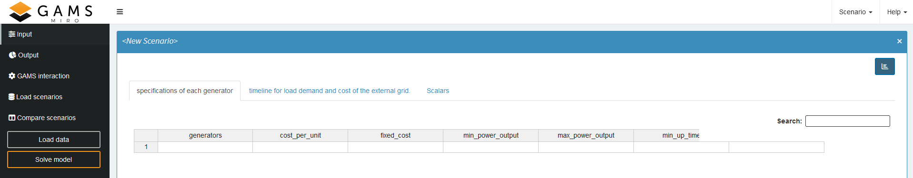
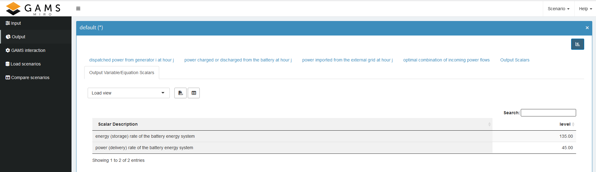
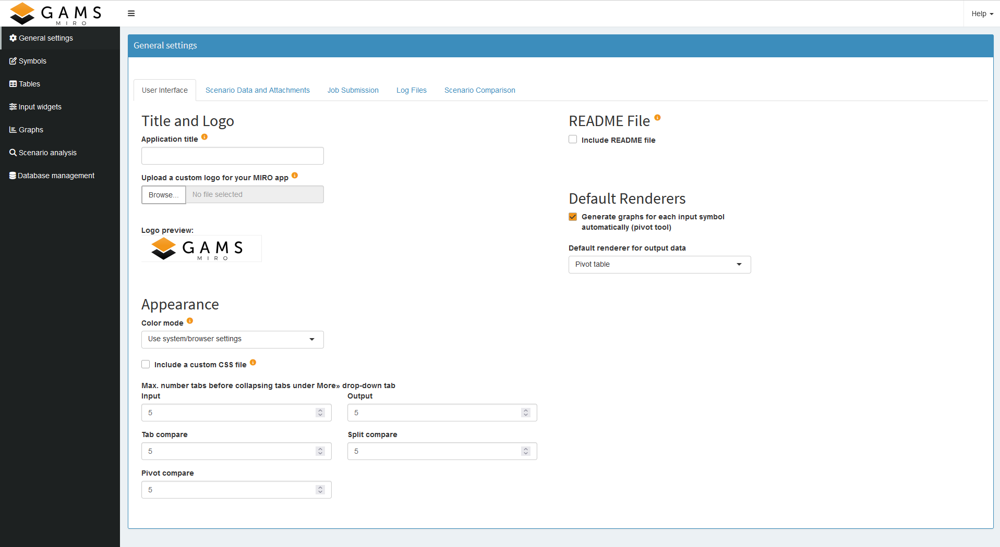
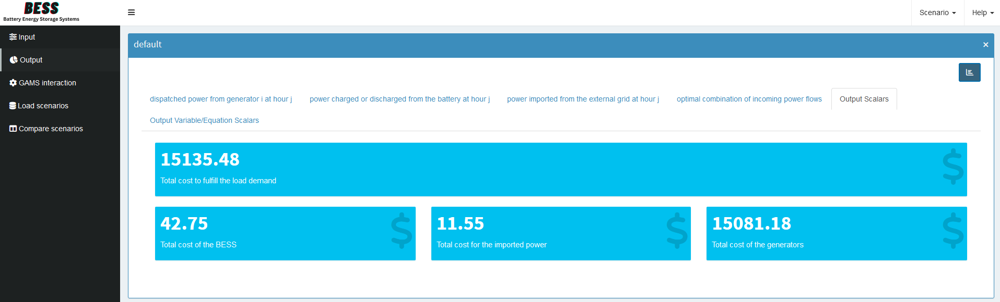
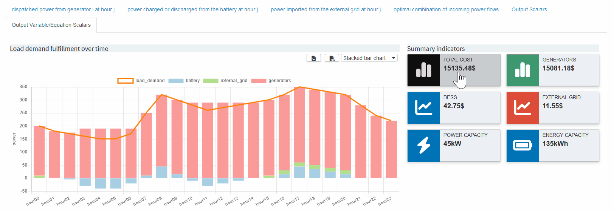
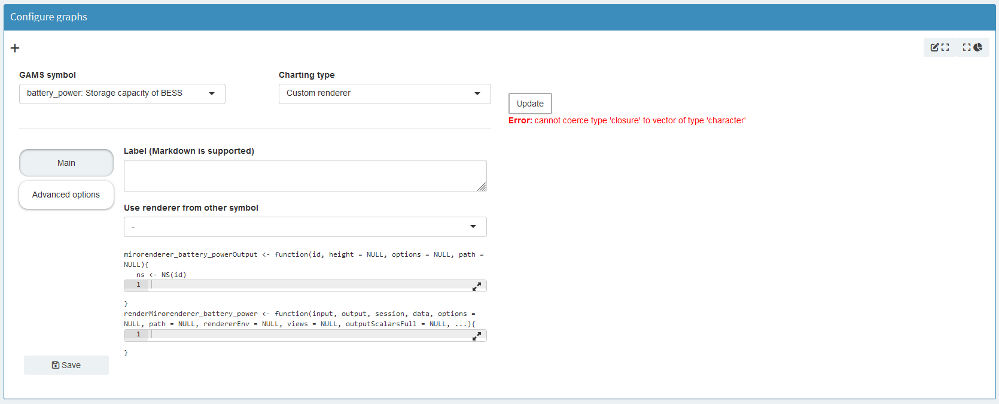
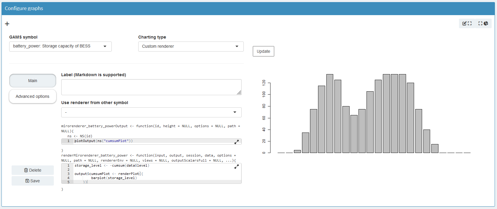
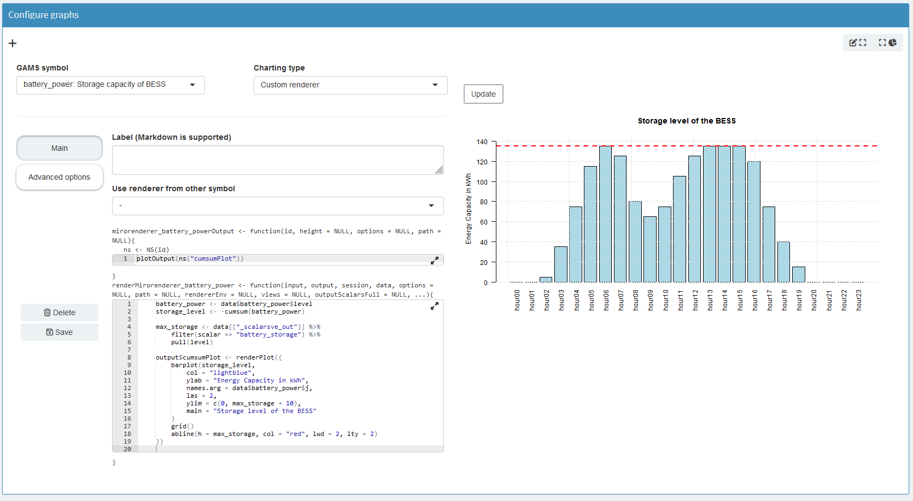
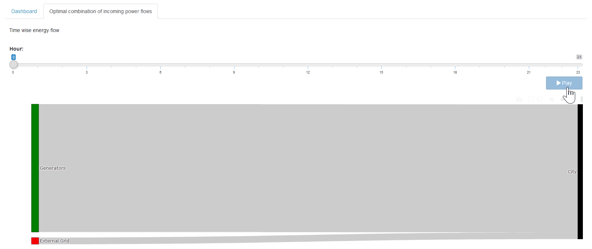
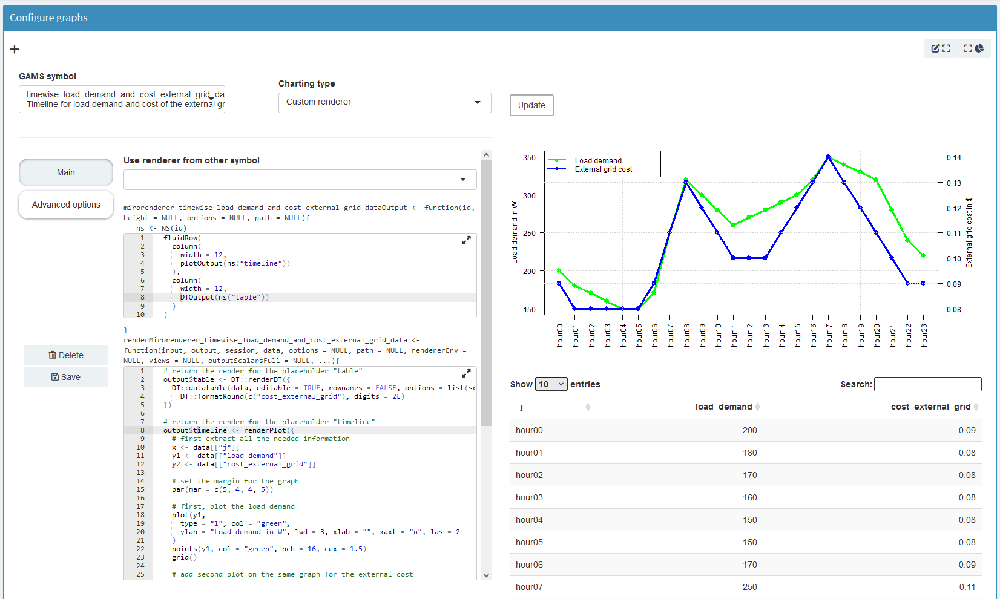

# From GAMSPy Model to MIRO App

In this tutorial we will have a look at the many features MIRO offers to generate an application for your optimization problem. This can be done starting with either a GAMS or GAMSPy implementation of your model. In this tutorial we will start with a GAMSPy model, where we will first have to define the input and output of our application. Note that except for the first section where we go through the changes in the model, there is no difference for the MIRO configuration depending on whether you use GAMS or GAMSPy as the modelling language. Then we will look at the visualization options that you can use directly, based only on these input/output definitions. This can already be helpful when implementing the model, as you can quickly plot the output data and check that the results make sense. And if they do not add up, you have a good starting point for where to look for errors. Next we look at the configuration mode. Here you can add a lot of default configurations without having to touch any code. Since the configuration mode options are sometimes not enough, we will then look at adding some custom renderers and custom widgets. Finally, we will look at some more custom additions that you can add to your MIRO application.

If you don't have MIRO, you need to [install it](https://www.gams.com/miro/download.html) first.

## Implement the Model

First you need to implement the model you want to make an application for, using either GAMS or GAMSPy, as mentioned above we will be using GAMSPy. For instructions on what code changes you need to make in GAMS, see the [documentation](https://www.gams.com/miro/model.html#model-adjustments). 

We will look at a "A Battery Energy Storage System (BESS) sizing problem". This model is based on an example from the company [NAG](https://nag.com/), which can be found on their GitHub: [BESS.ipynb](https://github.com/numericalalgorithmsgroup/NAGPythonExamples/blob/master/local_optimization/MILP/BESS_MILP.ipynb).
This model aims to optimize a city's hourly energy schedule by selecting the most cost-effective combination of energy sources, including the use of a BESS to store low-cost energy during off-peak hours and release it during high-demand periods. By evaluating the storage capacity and discharge rate of various BESS options, the model identifies the configuration that minimizes overall energy costs while reliably meeting demand. We recommend that you have a quick look at the mathematical description in the README.md first, since we will use the variable names directly. 

**Either give the Readme here or prob better link to the gallery**

**NEED TO MAKE SURE LOWER/UPPERCASE FOR DESCRIPTIONS IS CONSISTENT**

<details>
  <summary>GAMSPy model code</summary>

```python
import pandas as pd
import sys

from gamspy import (
    Container,
    Alias,
    Equation,
    Model,
    Parameter,
    Sense,
    Set,
    Sum,
    Variable,
    Ord,
    Options,
)


def main():
    m = Container()

    # Generator parameters
    generator_specifications_input = pd.DataFrame(
        [
            ["gen0", 0.010694, 142.7348, 30, 70, 8, 6],
            ["gen1", 0.018761, 168.9075, 50, 100, 8, 6],
            ["gen2", 0.0076121, 313.9102, 30, 120, 8, 6],
        ],
        columns=[
            "i",
            "cost_per_unit",
            "fixed_cost",
            "min_power_output",
            "max_power_output",
            "min_up_time",
            "min_down_time",
        ],
    )

    # Load demand to be fulfilled by the energy management system
    timewise_load_demand_and_cost_external_grid_input = pd.DataFrame(
        [
            ["hour00", 200, 0.09],
            ["hour01", 180, 0.08],
            ["hour02", 170, 0.08],
            ["hour03", 160, 0.08],
            ["hour04", 150, 0.08],
            ["hour05", 150, 0.08],
            ["hour06", 170, 0.09],
            ["hour07", 250, 0.11],
            ["hour08", 320, 0.13],
            ["hour09", 300, 0.12],
            ["hour10", 280, 0.11],
            ["hour11", 260, 0.10],
            ["hour12", 270, 0.10],
            ["hour13", 280, 0.10],
            ["hour14", 290, 0.11],
            ["hour15", 300, 0.12],
            ["hour16", 320, 0.13],
            ["hour17", 350, 0.14],
            ["hour18", 340, 0.13],
            ["hour19", 330, 0.12],
            ["hour20", 320, 0.11],
            ["hour21", 280, 0.10],
            ["hour22", 240, 0.09],
            ["hour23", 220, 0.09],
        ],
        columns=["j", "load_demand", "cost_external_grid"],
    )

    # Set
    i = Set(
        m,
        name="i",
        records=generator_specifications_input["i"],
        description="generators",
    )
    j = Set(
        m,
        name="j",
        records=timewise_load_demand_and_cost_external_grid_input["j"],
        description="hours",
    )
    t = Alias(m, name="t", alias_with=j)

    # Data
    # Generator parameters
    gen_cost_per_unit = Parameter(
        m,
        name="gen_cost_per_unit",
        domain=[i],
        records=generator_specifications_input[["i", "cost_per_unit"]],
        description="cost per unit of generator i",
    )

    gen_fixed_cost = Parameter(
        m,
        name="gen_fixed_cost",
        domain=[i],
        records=generator_specifications_input[["i", "fixed_cost"]],
        description="fixed cost of generator i",
    )

    gen_min_power_output = Parameter(
        m,
        name="gen_min_power_output",
        domain=[i],
        records=generator_specifications_input[["i", "min_power_output"]],
        description="minimal power output of generator i",
    )

    gen_max_power_output = Parameter(
        m,
        name="gen_max_power_output",
        domain=[i],
        records=generator_specifications_input[["i", "max_power_output"]],
        description="maximal power output of generator i",
    )

    gen_min_up_time = Parameter(
        m,
        name="gen_min_up_time",
        domain=[i],
        records=generator_specifications_input[["i", "min_up_time"]],
        description="minimal up time of generator i",
    )

    gen_min_down_time = Parameter(
        m,
        name="gen_min_down_time",
        domain=[i],
        records=generator_specifications_input[["i", "min_down_time"]],
        description="minimal down time of generator i",
    )

    # Battery parameters
    cost_bat_power = Parameter(m, "cost_bat_power", records=0.2)
    cost_bat_energy = Parameter(m, "cost_bat_energy", records=0.25)

    # Load demand and external grid
    load_demand = Parameter(
        m,
        name="load_demand",
        domain=[j],
        records=timewise_load_demand_and_cost_external_grid_input[["j", "load_demand"]],
        description="load demand at hour j",
    )

    cost_external_grid = Parameter(
        m,
        name="cost_external_grid",
        domain=[j],
        records=timewise_load_demand_and_cost_external_grid_input[
            ["j", "cost_external_grid"]
        ],
        description="cost of the external grid at hour j",
    )

    max_input_external_grid = Parameter(
        m,
        name="max_input_external_grid",
        records=15,
        description="maximal power that can be imported from the external grid every hour",
    )

    # Variable
    # Generator
    gen_power = Variable(
        m,
        name="gen_power",
        type="positive",
        domain=[i, j],
        description="Dispatched power from generator i at hour j",
    )

    gen_active = Variable(
        m,
        name="gen_active",
        type="binary",
        domain=[i, j],
        description="is generator i active at hour j",
    )

    # Battery
    battery_power = Variable(
        m,
        name="battery_power",
        domain=[j],
        description="power charged or discharged from the battery at hour j",
    )

    battery_delivery_rate = Variable(
        m,
        name="battery_delivery_rate",
        description="power (delivery) rate of the battery energy system",
    )

    battery_storage = Variable(
        m,
        name="battery_storage",
        description="energy (storage) rate of the battery energy system",
    )

    # External grid
    external_grid_power = Variable(
        m,
        name="external_grid_power",
        type="positive",
        domain=[j],
        description="power imported from the external grid at hour j",
    )

    # Equation
    fulfill_load = Equation(
        m,
        name="fulfill_load",
        domain=[j],
        description="load balance needs to be met very hour j",
    )

    gen_above_min_power = Equation(
        m,
        name="gen_above_min_power",
        domain=[i, j],
        description="generators power should be above the minimal output",
    )

    gen_below_max_power = Equation(
        m,
        name="gen_below_max_power",
        domain=[i, j],
        description="generators power should be below the maximal output",
    )

    gen_above_min_down_time = Equation(
        m,
        name="gen_above_min_down_time",
        domain=[i, j],
        description="generators down time should be above the minimal down time",
    )

    gen_above_min_up_time = Equation(
        m,
        name="gen_above_min_up_time",
        domain=[i, j],
        description="generators up time should be above the minimal up time",
    )

    battery_above_min_delivery = Equation(
        m,
        name="battery_above_min_delivery",
        domain=[j],
        description="battery delivery rate (charge rate) above min power rate",
    )

    battery_below_max_delivery = Equation(
        m,
        name="battery_below_max_delivery",
        domain=[j],
        description="battery delivery rate below max power rate",
    )

    battery_above_min_storage = Equation(
        m,
        name="battery_above_min_storage",
        domain=[t],
        description="battery storage above negative energy rate (since negative power charges the battery)",
    )

    battery_below_max_storage = Equation(
        m,
        name="battery_below_max_storage",
        domain=[t],
        description="sum over battery delivery below zero (cant deliver energy that is not stored)",
    )

    external_power_upper_limit = Equation(
        m,
        name="external_power_upper_limit",
        domain=[j],
        description=" input from the external grid is limited",
    )

    fulfill_load[j] = (
        Sum(i, gen_power[i, j]) + battery_power[j] + external_grid_power[j]
        == load_demand[j]
    )

    gen_above_min_power[i, j] = (
        gen_min_power_output[i] * gen_active[i, j] <= gen_power[i, j]
    )

    gen_below_max_power[i, j] = (
        gen_power[i, j] <= gen_max_power_output[i] * gen_active[i, j]
    )

    # if j=0 -> j.lag(1) = 0 which doesn't brake the equation,
    # since generator is of at start, resulting in negative right side, therefore the sum is always above
    gen_above_min_down_time[i, j] = Sum(
        t.where[(Ord(t) >= Ord(j)) & (Ord(t) <= (Ord(j) + gen_min_down_time[i] - 1))],
        1 - gen_active[i, t],
    ) >= gen_min_down_time[i] * (gen_active[i, j.lag(1)] - gen_active[i, j])

    # and for up it correctly starts the check that if its turned on in the first step
    # it has to stay on for the min up time
    gen_above_min_up_time[i, j] = Sum(
        t.where[(Ord(t) >= Ord(j)) & (Ord(t) <= (Ord(j) + gen_min_up_time[i] - 1))],
        gen_active[i, t],
    ) >= gen_min_up_time[i] * (gen_active[i, j] - gen_active[i, j.lag(1)])

    battery_above_min_delivery[j] = -battery_delivery_rate <= battery_power[j]

    battery_below_max_delivery[j] = battery_power[j] <= battery_delivery_rate

    battery_above_min_storage[t] = -battery_storage <= Sum(
        j.where[Ord(j) <= Ord(t)], battery_power[j]
    )

    battery_below_max_storage[t] = Sum(j.where[Ord(j) <= Ord(t)], battery_power[j]) <= 0

    external_power_upper_limit[j] = external_grid_power[j] <= max_input_external_grid

    obj = (
        Sum(
            j,
            Sum(i, gen_cost_per_unit[i] * gen_power[i, j] + gen_fixed_cost[i])
            + cost_external_grid[j] * external_grid_power[j],
        )
        + cost_bat_power * battery_delivery_rate
        + cost_bat_energy * battery_storage
    )

    # Solve
    bess = Model(
        m,
        name="bess",
        equations=m.getEquations(),
        problem="MIP",
        sense=Sense.MIN,
        objective=obj,
    )

    bess.solve(
        solver="CPLEX",
        output=sys.stdout,
        options=Options(equation_listing_limit=1, relative_optimality_gap=0),
    )


if __name__ == "__main__":
    main()

```

</details>

### Input

Let's start with the simpler inputs. As you can see, we have three scalar input parameters. For these we simply need to add the `is_miro_input=True` option to their parameter definitions.

```python
# Battery parameters
cost_bat_power = Parameter(m, "cost_bat_power", records=0.2, is_miro_input=True)
cost_bat_energy = Parameter(m, "cost_bat_energy", records=0.25, is_miro_input=True)

# Load demand and external grid
max_input_external_grid = Parameter(
    m,
    name="max_input_external_grid",
    records=15,
    is_miro_input=True,
    description="maximal power that can be imported from the external grid every hour",
)

```

For the generator specifications and schedule inputs, we need to change a little more. The model depends on two sets, one for the possible generators and one for the hours when the load demand should be met. Since these two sets are not fixed, but should be part of the input, we will use [Domain Forwarding](https://gamspy.readthedocs.io/en/latest/user/basics/set.html#implicit-set-definition-via-domain-forwarding). This means that we implicitly define our set based on one parameter. However, since we have multiple parameters that depend on these sets, and we want to have a single source of truth, we need to combine them. So in our MIRO application we will end up with one table containing all the generator specifications and one for the schedule. To do this, we define additional sets for the corresponding headers:

```python

generator_spec_header = Set(
    m,
    name="generator_spec_header",
    records=[
        "cost_per_unit",
        "fixed_cost",
        "min_power_output",
        "max_power_output",
        "min_up_time",
        "min_down_time",
    ],
)
```

And a parameter that contains all the information:

```python
generator_specifications = Parameter(
    m,
    name="generator_specifications",
    domain=[i, generator_spec_header],
    domain_forwarding=[True, False],
    records=generator_specifications_input.melt(
        id_vars="i", var_name="generator_spec_header"
    ),
    is_miro_input=True,
    is_miro_table=True,
    description="Specifications of each generator",
)
```

Note that we set `is_miro_input=True` again. Since we want them to be displayed as tables, we also set `is_miro_table=True`. Finally, the most important part, we need to set `domain_forwarding=[True, False]`. This means that we want the domain corresponding to our generator set to be forwarded so that the set elements are taken from the MIRO application. The headers are known and not part of the input, so we set the second element to `False`. We will still use our data to initialize our specifications, since we have changed the format to only the columns `"i"` and `"generator_spec_header"`, we need to [`melt()`](https://pandas.pydata.org/docs/reference/api/pandas.melt.html) the input data to get the same format.

Finally, we no longer specify the `records' of the set `i` and any parameters dependent on `i` (e.g. `gen_cost_per_unit`). The set now gets the data through the domain forwarding. For the parameters, we need to assign the appropriate column.

```diff
i = Set(
    m,
    name="i",
-    records=generator_specifications_input["i"],
    description="generators",
)

gen_cost_per_unit = Parameter(
      m,
      name="gen_cost_per_unit",
      domain=[i],
-     records=generator_specifications_input[["i", "cost_per_unit"]],
      description="cost per unit of generator i",
  )

+ gen_cost_per_unit[i] = generator_specifications[i, "cost_per_unit"]

```

Do the same for the other parameters that depend on `i`. We also have two parameters that depend on the given hour, `load_demand` and `cost_external_grid`, so to have a single source of truth regarding the hour set we combine them into one parameter. Now we just need to make the same changes as for the generator specifications. 

In this example it is not necessary to do any further calculations based on the input values. But this could easily be done. An example of this can be seen in [VRPTW](https://miro.gams.com/gallery/app_direct/vrptw/). Here we have longitude and latitude values as input, but our model needs the individual distances. So we simply define a new parameter that depends on our MIRO input. You can use any mathematical calculation allowed in Python for this!

**IS THE EXAMPLE TO RANDOM? MAYBE JUST MENTION THAT YOU CAN DO IT WITHOUT EXAMPLE. OR HIDE THE CODE IF NOT CLICKED**

```python
earth_radius = 6371
help_d[i, j] = sqr(
    sin((customer_data[i, "lat"] - customer_data[j, "lat"]) * np.pi / (2 * 180))
) + (
    cos(customer_data[i, "lat"] * np.pi / 180)
    * cos(customer_data[j, "lat"] * np.pi / 180)
    * sqr(
        sin((customer_data[i, "lng"] - customer_data[j, "lng"]) * np.pi / (2 * 180))
    )
)

d[i, j] = 2 * earth_radius * atan2(sqrt(help_d[i, j]), sqrt(1 - help_d[i, j]))
```

Given the input, we move on to the output.

### Output 

When implementing the model it is useful to set all variables to output with: `is_miro_output=True`. This way, after solving, you can quickly check what the calculated variable values are and possibly find any remaining errors in the model.

```python
gen_power = Variable(
    m,
    name="gen_power",
    type="positive",
    domain=[i, j],
    description="Dispatched power from generator i at hour j",
    is_miro_output=True,
)
```

In general, you can make any variable or parameter an MIRO output. Sometimes it makes sense to define parameters as outputs depending on the variables. A simple example of this in our model would be to define individual parameters for the three cost factors we have. This way we can display these values directly in the MIRO application. 

```python
total_cost_gen = Parameter(
    m,
    "total_cost_gen",
    is_miro_output=True,
    description="Total cost of the generators",
)

total_cost_gen[...] = Sum(
    j, Sum(i, gen_cost_per_unit[i] * gen_power.l[i, j] + gen_fixed_cost[i])
)
```

Do the same for the other power sources and then combine them.

<details>
  <summary>Costs for the other power sources</summary>

```python
total_cost_battery = Parameter(
    m,
    "total_cost_battery",
    is_miro_output=True,
    description="Total cost of the BESS",
)

total_cost_battery[...] = (
    cost_bat_power * battery_delivery_rate.l + cost_bat_energy * battery_storage.l
)

total_cost_extern = Parameter(
    m,
    "total_cost_extern",
    is_miro_output=True,
    description="Total cost for the imported power",
)

total_cost_extern[...] = Sum(
    j,
    cost_external_grid[j] * external_grid_power.l[j],
)

total_cost = Parameter(
    m,
    "total_cost",
    is_miro_output=True,
    description="Total cost to fulfill the load demand",
)

total_cost[...] = total_cost_gen + total_cost_battery + total_cost_extern
```
</details>

In our example, we also want to combine the power variables with the load demand input into one output parameter. This will help us later to show directly that the sum of the powers equals the load demand.

```python
# Power output
power_output_header = Set(
    m,
    name="power_output_header",
    records=["battery", "external_grid", "generators", "load_demand"],
)

report_output = Parameter(
    m,
    name="report_output",
    domain=[j, power_output_header],
    description="Optimal combination of incoming power flows",
    is_miro_output=True,
)

report_output[j, "generators"] = Sum(i, gen_power.l[i, j])
report_output[j, "battery"] = battery_power.l[j]
report_output[j, "external_grid"] = external_grid_power.l[j]
report_output[j, "load_demand"] = load_demand[j]
```

<details>
  <summary>Full updated GAMSPy model</summary>

```python
import pandas as pd
import sys

from gamspy import (
    Container,
    Alias,
    Equation,
    Model,
    Parameter,
    Sense,
    Set,
    Sum,
    Variable,
    Ord,
    Options,
)


def main():
    m = Container()

    # Generator parameters
    generator_specifications_input = pd.DataFrame(
        [
            ["gen0", 0.010694, 142.7348, 30, 70, 8, 6],
            ["gen1", 0.018761, 168.9075, 50, 100, 8, 6],
            ["gen2", 0.0076121, 313.9102, 30, 120, 8, 6],
        ],
        columns=[
            "i",
            "cost_per_unit",
            "fixed_cost",
            "min_power_output",
            "max_power_output",
            "min_up_time",
            "min_down_time",
        ],
    )

    # Load demand to be fulfilled by the energy management system
    # combine with cost external grid, to have one source of truth for the hours (Set j)
    timewise_load_demand_and_cost_external_grid_input = pd.DataFrame(
        [
            ["hour00", 200, 0.09],
            ["hour01", 180, 0.08],
            ["hour02", 170, 0.08],
            ["hour03", 160, 0.08],
            ["hour04", 150, 0.08],
            ["hour05", 150, 0.08],
            ["hour06", 170, 0.09],
            ["hour07", 250, 0.11],
            ["hour08", 320, 0.13],
            ["hour09", 300, 0.12],
            ["hour10", 280, 0.11],
            ["hour11", 260, 0.10],
            ["hour12", 270, 0.10],
            ["hour13", 280, 0.10],
            ["hour14", 290, 0.11],
            ["hour15", 300, 0.12],
            ["hour16", 320, 0.13],
            ["hour17", 350, 0.14],
            ["hour18", 340, 0.13],
            ["hour19", 330, 0.12],
            ["hour20", 320, 0.11],
            ["hour21", 280, 0.10],
            ["hour22", 240, 0.09],
            ["hour23", 220, 0.09],
        ],
        columns=["j", "load_demand", "cost_external_grid"],
    )

    # Set
    i = Set(
        m,
        name="i",
        description="generators",
    )
    j = Set(
        m,
        name="j",
        description="hours",
    )
    t = Alias(m, name="t", alias_with=j)

    generator_spec_header = Set(
        m,
        name="generator_spec_header",
        records=[
            "cost_per_unit",
            "fixed_cost",
            "min_power_output",
            "max_power_output",
            "min_up_time",
            "min_down_time",
        ],
    )

    timewise_header = Set(
        m, name="timewise_header", records=["load_demand", "cost_external_grid"]
    )

    # Data
    # Generator parameters
    generator_specifications = Parameter(
        m,
        name="generator_specifications",
        domain=[i, generator_spec_header],
        domain_forwarding=[True, False],
        records=generator_specifications_input.melt(
            id_vars="i", var_name="generator_spec_header"
        ),
        is_miro_input=True,
        is_miro_table=True,
        description="Specifications of each generator",
    )

    # To improve readability of the equations we extract the individual columns.
    # Since we want a single source of truth we combine them for MIRO.
    gen_cost_per_unit = Parameter(
        m,
        name="gen_cost_per_unit",
        domain=[i],
        description="cost per unit of generator i",
    )

    gen_fixed_cost = Parameter(
        m, name="gen_fixed_cost", domain=[i], description="fixed cost of generator i"
    )

    gen_min_power_output = Parameter(
        m,
        name="gen_min_power_output",
        domain=[i],
        description="minimal power output of generator i",
    )

    gen_max_power_output = Parameter(
        m,
        name="gen_max_power_output",
        domain=[i],
        description="maximal power output of generator i",
    )

    gen_min_up_time = Parameter(
        m,
        name="gen_min_up_time",
        domain=[i],
        description="minimal up time of generator i",
    )

    gen_min_down_time = Parameter(
        m,
        name="gen_min_down_time",
        domain=[i],
        description="minimal down time of generator i",
    )

    gen_cost_per_unit[i] = generator_specifications[i, "cost_per_unit"]
    gen_fixed_cost[i] = generator_specifications[i, "fixed_cost"]
    gen_min_power_output[i] = generator_specifications[i, "min_power_output"]
    gen_max_power_output[i] = generator_specifications[i, "max_power_output"]
    gen_min_up_time[i] = generator_specifications[i, "min_up_time"]
    gen_min_down_time[i] = generator_specifications[i, "min_down_time"]

    # Battery parameters
    cost_bat_power = Parameter(m, "cost_bat_power", records=0.2, is_miro_input=True)
    cost_bat_energy = Parameter(m, "cost_bat_energy", records=0.25, is_miro_input=True)

    # Load demand and external grid
    timewise_load_demand_and_cost_external_grid_data = Parameter(
        m,
        name="timewise_load_demand_and_cost_external_grid_data",
        domain=[j, timewise_header],
        domain_forwarding=[True, False],
        records=timewise_load_demand_and_cost_external_grid_input.melt(
            id_vars="j", var_name="timewise_header"
        ),
        is_miro_input=True,
        is_miro_table=True,
        description="Timeline for load demand and cost of the external grid.",
    )

    load_demand = Parameter(
        m, name="load_demand", domain=[j], description="load demand at hour j"
    )

    cost_external_grid = Parameter(
        m,
        name="cost_external_grid",
        domain=[j],
        description="cost of the external grid at hour j",
    )

    load_demand[j] = timewise_load_demand_and_cost_external_grid_data[j, "load_demand"]
    cost_external_grid[j] = timewise_load_demand_and_cost_external_grid_data[
        j, "cost_external_grid"
    ]

    max_input_external_grid = Parameter(
        m,
        name="max_input_external_grid",
        records=15,
        is_miro_input=True,
        description="maximal power that can be imported from the external grid every hour",
    )

    # Variable
    # Generator
    gen_power = Variable(
        m,
        name="gen_power",
        type="positive",
        domain=[i, j],
        description="Dispatched power from generator i at hour j",
        is_miro_output=True,
    )

    gen_active = Variable(
        m,
        name="gen_active",
        type="binary",
        domain=[i, j],
        description="is generator i active at hour j",
    )

    # Battery
    battery_power = Variable(
        m,
        name="battery_power",
        domain=[j],
        description="power charged or discharged from the battery at hour j",
        is_miro_output=True,
    )

    battery_delivery_rate = Variable(
        m,
        name="battery_delivery_rate",
        description="power (delivery) rate of the battery energy system",
        is_miro_output=True,
    )

    battery_storage = Variable(
        m,
        name="battery_storage",
        description="energy (storage) rate of the battery energy system",
        is_miro_output=True,
    )

    # External grid
    external_grid_power = Variable(
        m,
        name="external_grid_power",
        type="positive",
        domain=[j],
        description="power imported from the external grid at hour j",
        is_miro_output=True,
    )

    # Equation
    fulfill_load = Equation(
        m,
        name="fulfill_load",
        domain=[j],
        description="load balance needs to be met very hour j",
    )

    gen_above_min_power = Equation(
        m,
        name="gen_above_min_power",
        domain=[i, j],
        description="generators power should be above the minimal output",
    )

    gen_below_max_power = Equation(
        m,
        name="gen_below_max_power",
        domain=[i, j],
        description="generators power should be below the maximal output",
    )

    gen_above_min_down_time = Equation(
        m,
        name="gen_above_min_down_time",
        domain=[i, j],
        description="generators down time should be above the minimal down time",
    )

    gen_above_min_up_time = Equation(
        m,
        name="gen_above_min_up_time",
        domain=[i, j],
        description="generators up time should be above the minimal up time",
    )

    battery_above_min_delivery = Equation(
        m,
        name="battery_above_min_delivery",
        domain=[j],
        description="battery delivery rate (charge rate) above min power rate",
    )

    battery_below_max_delivery = Equation(
        m,
        name="battery_below_max_delivery",
        domain=[j],
        description="battery delivery rate below max power rate",
    )

    battery_above_min_storage = Equation(
        m,
        name="battery_above_min_storage",
        domain=[t],
        description="battery storage above negative energy rate (since negative power charges the battery)",
    )

    battery_below_max_storage = Equation(
        m,
        name="battery_below_max_storage",
        domain=[t],
        description="sum over battery delivery below zero (cant deliver energy that is not stored)",
    )

    external_power_upper_limit = Equation(
        m,
        name="external_power_upper_limit",
        domain=[j],
        description=" input from the external grid is limited",
    )

    fulfill_load[j] = (
        Sum(i, gen_power[i, j]) + battery_power[j] + external_grid_power[j]
        == load_demand[j]
    )

    gen_above_min_power[i, j] = (
        gen_min_power_output[i] * gen_active[i, j] <= gen_power[i, j]
    )

    gen_below_max_power[i, j] = (
        gen_power[i, j] <= gen_max_power_output[i] * gen_active[i, j]
    )

    # if j=0 -> j.lag(1) = 0 which doesn't brake the equation,
    # since generator is of at start, resulting in negative right side, therefore the sum is always above
    gen_above_min_down_time[i, j] = Sum(
        t.where[(Ord(t) >= Ord(j)) & (Ord(t) <= (Ord(j) + gen_min_down_time[i] - 1))],
        1 - gen_active[i, t],
    ) >= gen_min_down_time[i] * (gen_active[i, j.lag(1)] - gen_active[i, j])

    # and for up it correctly starts the check that if its turned on in the first step
    # it has to stay on for the min up time
    gen_above_min_up_time[i, j] = Sum(
        t.where[(Ord(t) >= Ord(j)) & (Ord(t) <= (Ord(j) + gen_min_up_time[i] - 1))],
        gen_active[i, t],
    ) >= gen_min_up_time[i] * (gen_active[i, j] - gen_active[i, j.lag(1)])

    battery_above_min_delivery[j] = -battery_delivery_rate <= battery_power[j]

    battery_below_max_delivery[j] = battery_power[j] <= battery_delivery_rate

    battery_above_min_storage[t] = -battery_storage <= Sum(
        j.where[Ord(j) <= Ord(t)], battery_power[j]
    )

    battery_below_max_storage[t] = Sum(j.where[Ord(j) <= Ord(t)], battery_power[j]) <= 0

    external_power_upper_limit[j] = external_grid_power[j] <= max_input_external_grid

    obj = (
        Sum(
            j,
            Sum(i, gen_cost_per_unit[i] * gen_power[i, j])  # + gen_fixed_cost[i])
            + cost_external_grid[j] * external_grid_power[j],
        )
        + cost_bat_power * battery_delivery_rate
        + cost_bat_energy * battery_storage
    )

    # Solve
    bess = Model(
        m,
        name="bess",
        equations=m.getEquations(),
        problem="MIP",
        sense=Sense.MIN,
        objective=obj,
    )

    bess.solve(
        solver="CPLEX",
        output=sys.stdout,
        options=Options(equation_listing_limit=1, relative_optimality_gap=0),
    )

    # Extract the output data

    # Power output
    power_output_header = Set(
        m,
        name="power_output_header",
        records=["battery", "external_grid", "generators", "load_demand"],
    )

    report_output = Parameter(
        m,
        name="report_output",
        domain=[j, power_output_header],
        description="Optimal combination of incoming power flows",
        is_miro_output=True,
    )

    report_output[j, "generators"] = Sum(i, gen_power.l[i, j])
    report_output[j, "battery"] = battery_power.l[j]
    report_output[j, "external_grid"] = external_grid_power.l[j]
    report_output[j, "load_demand"] = load_demand[j]

    # Costs
    total_cost_gen = Parameter(
        m,
        "total_cost_gen",
        is_miro_output=True,
        description="Total cost of the generators",
    )

    total_cost_gen[...] = Sum(
        j, Sum(i, gen_cost_per_unit[i] * gen_power.l[i, j] + gen_fixed_cost[i])
    )

    total_cost_battery = Parameter(
        m,
        "total_cost_battery",
        is_miro_output=True,
        description="Total cost of the BESS",
    )

    total_cost_battery[...] = (
        cost_bat_power * battery_delivery_rate.l + cost_bat_energy * battery_storage.l
    )

    total_cost_extern = Parameter(
        m,
        "total_cost_extern",
        is_miro_output=True,
        description="Total cost for the imported power",
    )

    total_cost_extern[...] = Sum(
        j,
        cost_external_grid[j] * external_grid_power.l[j],
    )

    total_cost = Parameter(
        m,
        "total_cost",
        is_miro_output=True,
        description="Total cost to fulfill the load demand",
    )

    total_cost[...] = total_cost_gen + total_cost_battery + total_cost_extern

if __name__ == "__main__":
    main()

```
</details>

Now you can launch MIRO and have your first version of a fully interactive modelling application!

```bash
gamspy run miro --path <path_to_your_MIRO_installation> --model <path_to_your_model>
```

After starting MIRO, your application should look like this:

<div align="center">  </div>


## Rapid Prototyping

Now that we have our first MIRO application, let's see what kind of interaction we have right from the start. 

### Input

At first the input parameters are empty, if you click on *Load data* you have the option to load the default values specified by the records option in the GAMSPy code.

If the input parameters are correctly defined, you can now change the input and *Solve model* to obtain the solution for a different set of input values. 

Even at the input stage, it can sometimes be helpful to visualize the data to check for inconsistencies, e.g. that the load demand is never negative and should probably increase during the day and decrease at night, as should the cost of the external grid.

To do this you need to toggle the view in the top right corner by clicking on . Here you can filter, aggregate and pivot the data. It is also possible to directly use different chart types to visualize the data, this is done with [Pivot Table](https://www.gams.com/miro/charts.html#pivot-chart).

Here we pivoted the headers and selected line graphs. As the values for load_demand and cost_external_grid are not in the same dimension, the direct result is not very helpful as it appears that cost_external_grid is always zero. To make this clearer, we add a second y-axis. This is done by first setting the display type to *Line Chart* and then clicking on the  to add a new view. Here you can go to the *Second Axis* tab and select which series to plot in relation to it. You can also add a title and label for the axis. When you are happy with the result, save the view and press the  to activate the [Presentation Mode](https://www.gams.com/miro/charts.html#presentation-mode).

You should end up with something like this:

<div align="center">  </div>


### Output

When implementing the model, the output is definitely more interesting than the input, so lets see what we can do here. 

Scalar output values are split into scalar parameters and scalar variables/equations:

<div align="center">  </div>
<div align="center">  </div>

But we can do a lot more with the pivot tool. We might be interested to see which generator provides how much of the total power at what time. To do this we simply go to our output variable which contains the power values of the generators. Here we simply pivot by generator and filter the level value. Then we just need to select the Stacked Bar Chart and we end up with this:

<div align="center">  </div>

Now we can go back and see that *gen0* is the cheapest generator, but it also has the smallest maximum power output, so it needs help to provide full load demand, and apparently, even though the fixed cost of *gen2* is almost double, the generator has to produce so much power that its cheaper unit cost outweighs this. So it checks out. We can also make sure that the minimum up and down times are met. Finally, we can check that each generator, if active, is always within its permitted limits. If we find that one of these constraints is not being met, we immediately know which constraint in the model code we need to take a second look at.


Let us look at another example. Remember that in the model we combined all the power values with our given load demand into one parameter. By looking at this, we can see if the load demand is actually being met and which source contributed to it at each hour. If we were to use the Stacked Bar Chart again, we would not be able to easily compare the amount of load demand with the sum of the power sources. To do this, we change the type again to Stacked Bar Chart and then click the  to add a new view. Under the *Combo Chart* tab we can specify that we want the load demand to be displayed as a line chart and that it should not be included in the stack. You should end up with the following image:

<div align="center">  </div>


Here we can immediately see that the load demand is always exactly met. The only exception is when the BESS is being charged. We can see that the blue bar is always negative when the input power is higher than the load demand. This is another good check to see if all our constraints are met and if the results are logical.

You can do similar visualizations for the power from the battery and the external grid to check that their constraints are also being met. Hopefully you now have a better understanding of the powerful Pivot Tool and how to use it to check your implementation directly.

## Config Mode
Now that we have a better understanding of our model and are fairly confident that it satisfies all given constraints and provides a reasonable solution, we can begin to configure our application.

To do this, we will start our MIRO application in [config mode](https://www.gams.com/miro/customize.html).

```bash
gamspy run miro --mode="config" --path <path_to_your_MIRO_installation> --model <path_to_your_model>
```

You should land on this page:

<div align="center">  </div>

The [config mode](https://www.gams.com/miro/customize.html) provides a lot of customization right out of the box, so we don't need to write any code directly for now. 

### General Settings 

Let's start with some general settings. We will give our application a title, add our own logo, add a README and enable loading the default scenario on startup. These are just a few of the possible options, if your company has a specific CSS style you could include it here as well. To see all possible options, see the [General settings](https://www.gams.com/miro/configuration_general.html) documentation.


<div align="center">  </div>


### Symbols

Next, we will take a look at the [Symbols](https://www.gams.com/miro/configuration_symbols.html) section. Here we will first change our symbol aliases to make them sound more natural. Then, assuming that you are more likely to want to change the scalar values, we will change the order of the input. Finally, sometimes you need to define variables or parameters as output that you only need as additional data for some custom renderer (we will introduce custom renderers in the next section). If you have such output parameters, it makes sense to hide them so that they don't get their own tab on the output page.

<div align="center">  </div>

### Tables

In the [Tables](https://www.gams.com/miro/configuration_tables.html) sections you can customize the general configuration of input and output tables. We could apply these customizations to our input table, but it's not necessary in this case.

### Input Widgets

We have several inputs and we will customize them in the [Input Widgets](https://www.gams.com/miro/widgets.html) section. Let's take a look at our scalar inputs first. For these we can choose between slider, drop down menu, checkbox or numeric input. We will now set our inputs to sliders. If you don't want to impose any restrictions on the value (minimum, maximum and increment), you should stay with the numeric input. Just decide which option is best based on the type of input.

<div align="center">  </div>

For our multidimensional inputs we only have tables as an option directly in configuration mode. Here we can choose between three different types. We will stay with the default table for our two inputs. Since we don't have large datasets and, at least at the moment, don't plan to do a lot of editing here. If we know we are going to get huge datasets, it makes sense to switch to the *Big Data Table* since it is performance optimized. And if you know you will be doing a lot of editing in your table, you should choose the *Pivot Table*. For more details on table types, see the [documentation](https://www.gams.com/miro/widgets.html#widget-table).

If the three possible tables are not enough for your needs, you can add a custom widget, which we will do in the next section.

### Graphs

Now to the [Graphs](https://www.gams.com/miro/charts.html). This is where you can really play around with your visualization. For each multidimensional input or output symbol, you can define its default visualization. You can choose directly between the most common plot types or use the Pivot Table again, which we already used in the last section. You have probably already found some good views during rapid prototyping. Now you can define them as the default, so that everyone can start the application and see the chosen visualizations right away, and hopefully understand the results quickly.

The best way to really get an overview here is to just pick different symbols and play around with them for a while. Since we've already had a detailed look at the Pivot tool and some possible graphs, we won't go into too much detail here. We will just look at a small example by configuring value boxes for the output. First select a scenario, so far we only have the default. Then select the GAMS symbol *_scalars_out: Output Scalars* and the Charting Type *Valuebox for scalar values*. Here you can set the order of the value boxes, the color and the unit. Finally just *Save* the graph and start the base mode again and you have something like this:

<div align="center">  </div>

Now try adding the views we introduced in the last section. If you are looking for something specific, check out the [documentation](https://www.gams.com/miro/charts.html), here you will find an overview of all possible plot types and detailed descriptions for them. 

Note that any changes you make will be added to \<model_name\>.json. In the documentation you will find the corresponding json script you would need to add, but don't worry, this is exactly what the config mode does when you save a graph!

Finally, in the *Charting Type* you will also find the *Custom Renderer* option, which we will talk about in the next section.

#### Dashboard

You may have already noticed the Dashboard option in the Graphs section of the documentation. If you have now collected several views, perhaps even combined with a Key Performance Indicator (KPI), a dashboard might be a good idea.

Adding a dashboard is not possible directly from the config mode. However, you only need to look at the `\<model_name\>.json`. To add a dashboard, we will follow the explanation in the [documentation](https://www.gams.com/miro/charts.html#dashboard). Here we will only discuss the parts we use, for more information check the documentation.

First, you need to make a general plan of how you want the dashboard to look. By this we mean that you need to decide which "tiles" (value boxes) you want to have, and whether they have a corresponding Key Performance Indicator (KPI). Then you need to think about which views you want to associate with those value boxes. Most likely, you will select the views you have already created. 

Now we need to find our `\<model_name\>.json` in the `conf_ \<model_name\>` directory. Here we will look for the `dataRendering` key, or if it does not exist, we will define it (if you followed the tutorial it will not be there). We need to choose an output symbol to be our main parameter, but don't worry too much about this choice as we can add any other parameters we need. We just can't have another renderer for this specific symbol if we choose to have more output tabs than just the dashboard.

We will choose the symbol `"_scalarsve_out"`, which contains all output scalars of variables and/or equations, since we will probably not create an individual renderer for them. 

Getting more specific, in bess.json we now need to configure three things: 

1. Configure the value boxes and whether they should display a scalar value (KPI).
2. Configure which data view corresponds to which value box and which charts/tables it will contain.
3. Configure the individual charts/tables.

The basic layout for our dashboard for the symbol `"_scalarsve_out"` looks like this:

```json
{
  "dataRendering": {
    "_scalarsve_out": {
      "outType": "dashboard",
      "additionalData": [],
      "options": {
        "valueBoxesTitle": "",
        "valueBoxes": {
            ...
        },
        "dataViews": {
            ...
        },
        "dataViewsConfig": {
            ...
        }
      }
    }
  },
}
```

We will create our own renderers in the next section, but note that if you already have a custom renderer, it will also appear in the dataRendering section. 

To keep the code snippets concise, we will only look at the options we changed and have the full json at the end.

Normally you would not know all the datasets you need to add to `"additionalData"`. Here we will add `"report_output"`, `"gen_power"`, `"battery_power"` and `"external_grid_power"` since we already have an idea of which views we want to display. But of course you can add or remove symbols at any time. Further we will add the input symbol `"generator_specifications"` to easily check if the generator characteristic are fulfilled.

```json
"additionalData": ["report_output", "gen_power", "battery_power", "external_grid_power", "generator_specifications"]
```

In the options we can first set a title for the value boxes.

```json
    "valueBoxesTitle": "Summary indicators",
```

We will create six value boxes. However, we will only discuss the first two in detail.

```json
"valueBoxes": {
    "color": ["black", "olive"],
    "decimals": [2, 2],
    "icon": ["chart-simple", "chart-simple"],
    "id": ["total_cost", "gen_power"],
    "noColor": [true, true],
    "postfix": ["$", "$"],
    "prefix": ["", ""],
    "redPositive": [false, false],
    "title": ["Total Cost", "Generators"],
    "valueScalar": ["total_cost", "total_cost_gen"]
}
```

Each value box needs a unique id, it will be the link to our corresponding data view. However, value boxes can also be used without a corresponding view. We will also specify scalar parameters as KPIs for our value boxes. If you don't have a matching KPI, but still want to have the view in the dashboard, just set it to `null`. We also need to define some style parameters, see the [value box](https://www.gams.com/miro/charts.html#dashboard-valueboxes) documentation for more information.


<details>
  <summary>Click to see the code for all six boxes</summary>

```json
"valueBoxes": {
    "color": ["black", "olive", "blue", "red", "blue", "blue"],
    "decimals": [2, 2, 2, 2, 2, 2],
    "icon": ["chart-simple", "chart-simple", "chart-line", "chart-line", "bolt", "battery-full"],
    "id": ["total_cost", "gen_power", "battery_power", "external_grid_power", "battery_delivery_rate", "battery_storage"],
    "noColor": [true, true, true, true, true, true],
    "postfix": [ "$", "$", "$", "$", "kW", "kWh"],
    "prefix": ["", "", "", "", "",  ""],
    "redPositive": [ false, false, false, false, false, false],
    "title": ["Total Cost", "Generators", "BESS", "External Grid", "Power Capacity", "Energy Capacity"],
    "valueScalar": ["total_cost", "total_cost_gen", "total_cost_battery", "total_cost_extern", "battery_delivery_rate", "battery_storage"]
}
```
</details>


Now that we have our value boxes, we will define which views we want to associate with them. In the `"dataViews"` option, we will first define which charts/tables we want in this view. We will only associate views with the first four value boxes. This is because the last two also display BESS information and we only have one view for that. This is done by simply not specifying a view with the id of the value box for which we don't want to add a view.

We start each view with the `id` from the corresponding value field, then we assign a list of objects to it. Their keys are the individual id's of the different charts/tables we will define next in the `"dataViewsConfig"`, and as value we assign the title that will be displayed above the view in the dashboard. If you want to have more than one chart/table in a view, just add a second element to the object.


```json
"dataViews": {
    "battery_power": [{"BatteryTimeline": "Charge/Discharge of the BESS"}],
    "external_grid_power": [{"ExternalTimeline": "Power taken from the external grid"}],
    "gen_power": [{"GeneratorTimeline": "Generators Timeline"}, {"GeneratorSpec": ""}],
    "total_cost": [{"Balance": "Load demand fulfillment over time"}]
}
```

The only thing left to do is to specify the actual charts/tables to be displayed. This is also explained in detail in the [documentation](https://www.gams.com/miro/charts.html#dashboard-dataviewsconfig). The easiest way to add charts/tables is to first create the views with the pivot tool directly in the application. When you save the view, you can directly download the necessary json configurations. To do this, click on *Scenario* -> *Edit metadata* in the top right corner of the application and switch to the *View* tab. Here you can select a view and download its json file. Most of this can be copied directly. We just need to change the way we define which symbol the view is based on. It is no longer defined outside, but we will add `"data: "report_output"` to specify the symbol.

```diff
{
-  "report_output": {
    "Balance": {
      "aggregationFunction": "sum",
      "chartOptions": {
          "multiChartOptions": {
              "multiChartRenderer": "line",
              "multiChartStepPlot": false,
              "showMultiChartDataMarkers": false,
              "stackMultiChartSeries": "no"
          },
          "multiChartSeries": "load_demand",
          "showXGrid": true,
          "showYGrid": true,
          "singleStack": false,
          "yLogScale": false,
          "yTitle": "power"
      },
      "cols": {
          "power_output_header": null
      },
+     "data": "report_output",
      "domainFilter": {
          "default": null
      },
      "pivotRenderer": "stackedbar",
      "rows": "j",
      "tableSummarySettings": {
          "colSummaryFunction": "sum",
          "enabled": false,
          "rowSummaryFunction": "sum"
      }
    }
- }
}
```

Now we just need to place this inside the `"dataViewsConfig"`.


<details>
  <summary>Click to see the code for all four views</summary>

```json
"dataViewsConfig": {
    "Balance": {
        "aggregationFunction": "sum",
        "chartOptions": {
            "multiChartOptions": {
                "multiChartRenderer": "line",
                "multiChartStepPlot": false,
                "showMultiChartDataMarkers": false,
                "stackMultiChartSeries": "no"
            },
            "multiChartSeries": "load_demand",
            "showXGrid": true,
            "showYGrid": true,
            "singleStack": false,
            "yLogScale": false,
            "yTitle": "power"
        },
        "cols": {
            "power_output_header": null
        },
        "data": "report_output",
        "domainFilter": {
            "default": null
        },
        "pivotRenderer": "stackedbar",
        "rows": "j",
        "tableSummarySettings": {
            "colSummaryFunction": "sum",
            "enabled": false,
            "rowSummaryFunction": "sum"
        }
    },
    "BatteryTimeline": {
        "aggregationFunction": "sum",
        "chartOptions": {
            "showDataMarkers": true,
            "showXGrid": true,
            "showYGrid": true,
            "stepPlot": false,
            "yLogScale": false,
            "yTitle": "power"
        },
        "data": "battery_power",
        "domainFilter": {
            "default": null
        },
        "filter": {
            "Hdr": "level"
        },
        "pivotRenderer": "line",
        "rows": "j",
        "tableSummarySettings": {
            "colEnabled": false,
            "colSummaryFunction": "sum",
            "rowEnabled": false,
            "rowSummaryFunction": "sum"
        }
    },
    "ExternalTimeline": {
        "aggregationFunction": "sum",
        "chartOptions": {
            "showDataMarkers": true,
            "showXGrid": true,
            "showYGrid": true,
            "stepPlot": false,
            "yLogScale": false,
            "yTitle": "power"
        },
        "data": "external_grid_power",
        "domainFilter": {
            "default": null
        },
        "filter": {
            "Hdr": "level"
        },
        "pivotRenderer": "line",
        "rows": "j",
        "tableSummarySettings": {
            "colEnabled": false,
            "colSummaryFunction": "sum",
            "rowEnabled": false,
            "rowSummaryFunction": "sum"
        }
    },
    "GeneratorSpec": {
      "aggregationFunction": "sum",
      "pivotRenderer": "table",
      "domainFilter": {
          "default": null
      },
      "tableSummarySettings": {
          "rowEnabled": false,
          "rowSummaryFunction": "sum",
          "colEnabled": false,
          "colSummaryFunction": "sum"
      },
      "data": "generator_specifications",
      "rows":"i",
      "cols": {"Hdr": null}
    },
    "GeneratorTimeline": {
        "aggregationFunction": "sum",
        "chartOptions": {
            "showXGrid": true,
            "showYGrid": true,
            "singleStack": false,
            "yLogScale": false,
            "yTitle": "power"
        },
        "cols": {
            "i": null
        },
        "data": "gen_power",
        "domainFilter": {
            "default": null
        },
        "filter": {
            "Hdr": "level"
        },
        "pivotRenderer": "stackedbar",
        "rows": "j",
        "tableSummarySettings": {
            "colEnabled": false,
            "colSummaryFunction": "sum",
            "rowEnabled": false,
            "rowSummaryFunction": "sum"
        }
    }
}
```
</details>


**ADD THE FULL JSON**

<details>
  <summary>Click to see the full json file</summary>

```json

```
</details>

**REMAKE THE GIF WITHOUT THE EXTRA TABS AND THE NEW TABLE**

Finally, we end up with this dashboard:


<div align="center">  </div>

Note that now that we have all the outputs combined in the dashboard, it makes sense to hide the tabs for the individual output symbols and rename our dashboard. To make it less cluttered. Just a heads up, you should keep `"report_output"`, we will add a custom renderer for it in the next section.

It is also possible to add custom code to the dashboard. However, since this requires a bit more effort and you need to know how to create a custom renderer in the first place, we will leave this for the next section.

### Scenario analysis
Quite often you are not only interested in the optimal solution for a given input, but want to compare multiple scenarios.

**add dashboard comparison here**


### Database management

Finally the config mode also allows you to backup, remove or restore a [database](https://www.gams.com/miro/configuration_database.html).

### Custom Log

[Custom Log](https://www.gams.com/miro/configuration_general.html#miro-log)
make a custom log directly in the GAMSPy code
-> especially good for data validation

**change it to directly print and not write in a new file**


Since all these configurations do not take much time, this could be your first draft for the management. Now they can get an idea of what the final product might look like, and you can go deeper and add any further customizations you need. How to do this is explained in the next section.


## Fine Tuning with Custom Code

As mentioned before, sometimes you want to customize your application even more. This is also supported by MIRO, but now we need to start using some R code. 

### Custom renderer

We will start with a very simple renderer that shows us what the storage level of the BESS is at any given hour. So far we only know how much power is either charged or discharged. To get the storage level, we simply need to compute the cumulative sum of `battery_power`. In R, this function is built in: [`cumsum()`](https://www.rdocumentation.org/packages/base/versions/3.6.2/topics/cumsum). 

First, we need to understand what the general structure of a custom renderer is in MIRO. For this we will closely follow the [documentation](https://www.gams.com/miro/configuration_advanced.html#custom-renderers). Since MIRO is based on the R Shiny framework, it follows the same dual concept where we need to write two functions. One that defines the placeholder for your graphs, tables, etc. where they will be rendered, and the second that defines the rendering function itself. This means that in the second one we do all the necessary data manipulation, specification of behavior caused by user interaction, concrete data visualization etc. If this concept is new to you and you want more information visit the website for the R Shiny framework [https://shiny.posit.co/](https://shiny.posit.co/).

This brings us to the template for each custom renderer:

``` R
# Placeholder function must be postfixed with "Output" 
mirorenderer_<lowercaseSymbolName>Output <- function(id, height = NULL, options = NULL, path = NULL){
  ns <- NS(id)
}

# The actual rendering must be prefixed with the keyword "render"
renderMirorenderer_<lowercaseSymbolName> <- function(input, output, session, data, options = NULL, path = NULL, rendererEnv = NULL, views = NULL, outputScalarsFull = NULL, ...){

}
``` 

If you are not using the config mode, you must save these two functions in a file named `mirorenderer_\<lowercaseSymbolName\>.R`, which must be located in the `renderer_\<modelname\>` folder in your model directory. However, especially if you are new to R, we recommend that you use the config mode. It allows you to visualize the data directly with the correct datasets etc. passed to the functions. To do this, simply go to the *Graphs* section, select the GAMS symbol you want to render, and select *Custom renderer* for the *Charting type*.

<div align="center">  </div>

**Placeholder Function**

Let's take a closer look at the placeholder function first. The most important part is the `id`. Every custom renderer in Shiny needs a unique identifier (ID) to avoid conflicts with other renderers or internal functions of MIRO. This `id` allows your custom input and output elements to work without accidentally overwriting or interfering with other elements. Shiny provides a convenient tool for ID management: the [`NS()`](https://shiny.posit.co/r/reference/shiny/0.13.1/ns) function. This function takes the `id` of your custom renderer and returns a new function that automatically prefixes any input or output IDs you specify (functions that return functions are often called closures in R). In this way, `NS()` ensures that all IDs remain unique.

Here's how it works in practice:

- Define the prefix function: First, call `NS()` with the renderer's ID to create a function that we will store in a variable, often called `ns`.
- Use the prefix function on elements: Whenever you define a new input or output element, prefix its ID with `ns()`. This will give each element a unique prefixed ID.

For example, instead of writing `plotOutput("cumsumPlot", ...)`, you would use `plotOutput(ns("cumsumPlot"), ...)` to ensure that the cumsumPlot is uniquely identified throughout the application.

In our first simple renderer we only want to plot the storage, so we just need one output:

``` R
# Placeholder function
mirorenderer_battery_powerOutput <- function(id, height = NULL, options = NULL, path = NULL) {
    ns <- NS(id)
    plotOutput(ns("cumsumPlot"))
}
```

We will later also have a placeholder containing two elements, but you can have as many as you need. To get a better overview what is possible check the R Shiny documentation, e.g. their section on [Arrange Elements](https://shiny.posit.co/r/layouts/arrange/).


Beyond ID management, Shiny also allows you to define additional parameters for customization:

- You can set the `height` attribute of your renderer output to control the display size.
- Specify the `path` where the renderer files are located.
- Add additional `options`.


**The actual renderer**

The placeholder alone doesn't give us much, so let's define the renderer. We have defined an output with the output function [`plotOutput()`](https://shiny.posit.co/r/reference/shiny/latest/plotoutput). Now we need something to render inside. For this, you will assign [`renderPlot()`](https://shiny.posit.co/r/reference/shiny/latest/renderplot) to an output object, inside your rendering function, which is responsible for generating the plot. Here's an overview:

- Output functions: These functions determine how the data is displayed, such as `plotOutput()`.
- Rendering functions: These are functions in Shiny that transform your data into visual elements, such as plots, tables, or maps. For example, `renderPlot()` is a reactive plot suitable for assignment to an output slot.

Now we need a connection between our placeholder and the renderer. To do this, we look at the arguments the renderer gets

- `input`: Accesses elements that generate data, such as sliders, text input,... (`input$hour`).
- `output`: Controls elements that visualize data, such as plots, maps, or tables (`output$cumsumPlot`).
- `session`: Contains user-specific information.
- `data`: The data for the visualization is specified as an R [tibble](https://cran.r-project.org/web/packages/tibble/vignettes/tibble.html). If you've specified multiple datasets in your MIRO application, the data will be a named list of tibbles. Each element in this list corresponds to a GAMS symbol (`data$battery_power`).

For more information about the other options, see the [documentation](https://www.gams.com/miro/configuration_advanced.html#custom-renderers).

We will now return to the config mode and start building our first renderer. Hopefully you have already added `plotOutput(ns("cumsumPlot"))` to the placeholder function. To get a general idea of what we are working with, let us first take a look at the `data` by simply calling `print(data)` inside the renderer. If we now press *Update*, we still won't see anything, because no rendering has been done yet, but if we look at the console, we will see:

```
# A tibble: 24 × 6
   j      level marginal lower upper scale
   <chr>  <dbl>    <dbl> <dbl> <dbl> <dbl>
 1 hour00     0        0  -Inf   Inf     1
 2 hour01     0        0  -Inf   Inf     1
 3 hour02    -5        0  -Inf   Inf     1
 4 hour03   -30        0  -Inf   Inf     1
 5 hour04   -40        0  -Inf   Inf     1
 6 hour05   -40        0  -Inf   Inf     1
 7 hour06   -20        0  -Inf   Inf     1
 8 hour07    10        0  -Inf   Inf     1
 9 hour08    45        0  -Inf   Inf     1
10 hour09    15        0  -Inf   Inf     1
# ℹ 14 more rows
```

Since we have not specified any additional data sets so far, `data` directly contains the variable `battery_power`, which is obviously the GAMS symbol we put in the mirorender name. For our plot of the storage levels we now need the values from the `level` column, which we can access in R with `data$level`. More on subsetting tibbles can be found [here](https://tibble.tidyverse.org/reference/subsetting.html). Let's now finally make our first plot! First we need to calculate the data we want to plot, which we will store in `storage_level`. Note that we take the negative cumsum here, since the power levels are relative to the city, i.e. negative power charges the BESS and positive power discharges it. We will use the standard R [`barplot()`](https://www.rdocumentation.org/packages/graphics/versions/3.6.2/topics/barplot) for visualization, but remember you can use any R function you want! Finally, we just need to pass this reactive plot to a render function and assign it to the appropriate output variable, which we only have one so far. The code you entered should look something like this:  

``` R
storage_level <- -cumsum(data$level)

output$cumsumPlot <- renderPlot({
        barplot(storage_level)
    })
```

If you press *Update* again, you should get this:

<div align="center">  </div>

So far so good, let's make this graph prettier. Aside from adding a title, labels, etc., take a look at the y-axis. As you can see, it doesn't go all the way to the top. To change this, we can set it to the maximum value of our data. But what might be more interesting is to see the current storage value compared to the maximum possible. As you may remember, this maximum storage level is also part of our optimization. So now we need to add more data to our renderer. Here we can select from all possible GAMS symbols which ones we want to add by clicking on the file for *Additional datasets to communicate with the custom renderer*. Since we need a scalar variable here, we will add `"_scalarsve_out"`. Going back to the *Main* tab, we now need to change how we access the data, since it is no longer directly the tibble, but a named list of tibbles. Try extracting the value for `"battery_storage"` from `data`. Remember that you can use `print()` and the functions [`filter()`](https://www.rdocumentation.org/packages/dplyr/versions/0.7.8/topics/filter) and [`pull()`](https://www.rdocumentation.org/packages/lplyr/versions/0.1.6/topics/pull) can be helpful.


<details>
  <summary>See how to extract battery_storage</summary>

``` R
max_storage <- data[["_scalarsve_out"]] %>%
    filter(scalar == "battery_storage") %>%
    pull(level)
```
</details>

We will use the `"battery_storage"` for setting the `ylim` and for adding a horizontal line with [`abline()`](https://www.rdocumentation.org/packages/graphics/versions/3.6.2/topics/abline). Adding some more layout settings leads us to:

<div align="center">  </div>


<details>
  <summary>Click to see the code of the full renderer</summary>

``` R
mirorenderer_battery_powerOutput <- function(id, height = NULL, options = NULL, path = NULL) {
    ns <- NS(id)
    plotOutput(ns("cumsumPlot"))
}

renderMirorenderer_battery_power <- function(input, output, session, data, options = NULL, path = NULL, rendererEnv = NULL, views = NULL, outputScalarsFull = NULL, ...) {
    battery_power <- data$battery_power$level
    storage_level <- -cumsum(battery_power)

    max_storage <- data[["_scalarsve_out"]] %>%
        filter(scalar == "battery_storage") %>%
        pull(level)

    output$cumsumPlot <- renderPlot({
        barplot(storage_level,
            col = "lightblue", ylab = "Energy Capacity in kWh",
            names.arg = data$battery_power$j, las = 2, ylim = c(0, max_storage + 10),
            main = "Storage level of the BESS"
        )
        grid()
        abline(h = max_storage, col = "red", lwd = 2, lty = 2)
    })
}
```
</details>

Congratulations you created your first renderer!

Now just *Save* your renderer, this will directly create the file and folder mentioned above that you would have had to create if you were not using config mode. It will also add the necessary configuration to the json file. Again, if you are not using the config mode, you will need to add this manually, the template can be found in the [documentation](https://www.gams.com/miro/configuration_advanced.html#custom-renderers).

Note that for simple renderers like this that just apply functions to the parameters, you could do the same calculation directly in Python. You would simply define a new parameter based on the same calculation as in the renderer and then have all the visualization options as before. We  just used it here to explain the general concept of a custom renderer. But you wouldn't normally use a custom renderer for simple calculations like this!

Now that we have created our first small custom renderer, we can start working on some more complex renderers that use visualizations that are not supported in the config mode, but are possible in R.


#### A more complex renderer

We are going to make a simple Sankey diagram for our power flow. We will base this renderer on our `report_output` variable which contains the three power variables and the load demand. It will show the current power flow at a given hour, to change the hour we will add a slider. This results in the following placeholder function:

``` R
mirorenderer_report_outputOutput <- function(id, height = NULL, options = NULL, path = NULL) {
  ns <- NS(id)
  tagList(
    sliderInput(ns("hour"), "Hour:",
      min = 0, max = 23,
      value = 0, step = 1,
    ),
    plotly::plotlyOutput(ns("sankey"), height = "100%")
  )
}
``` 

Since we just want both elements on top of each other, we use a [`tagList()`](https://www.rdocumentation.org/packages/shiny/versions/0.9.1/topics/tagList). First we have our slider, which we give an id, again using the `ns()` function to prefix it. We give it some default `min` and `max` values, but since the number of hours could change, we will update the `max` value inside the renderer. Second, we have a plot for which we use [`plotlyOutput()`](https://www.rdocumentation.org/packages/plotly/versions/4.10.4/topics/plotly-shiny), since we will be using the *plotly* library to generate the Sankey plot. Note that *plotly* is not part of MIRO and needs to be added, this can be done in the same way as the additional data in the *Advanced options* menu. This also means that we need to specify the package name explicitly using the *double colon operator*. Again, if you are not using config mode, follow the [documentation](https://www.gams.com/miro/configuration_advanced.html#additional-r-packages).

Now that we have some placeholders, we need to fill them. As mentioned above, we will be using *plotly* to generate our [Sankey](https://plotly.com/r/sankey-diagram/) plot. Let us begin to set up our Sankey diagram. First, we need to decide which nodes we need. We will add one for the BESS, the generators, the external grid, and the city. You will need to remember the order so that you can assign the links correctly later.

``` R
node = list(
        label = c("BESS", "Generators", "External Grid", "City"),
        color = c("blue", "green", "red", "black"),
        pad = 15,
        thickness = 20,
        line = list(
          color = "black",
          width = 0.5
        )
)
``` 
With the nodes defined we need to set the links. Each link has a source, a target and a value. The possible sources and targets are defined by our given nodes. We will define lists for all three and fill them based on our data.

``` R
link = list(
    source = sankey_source,
    target = sankey_target,
    value =  sankey_value
)
``` 

To be able to display the power value of the correct time point we need to get the hour from our slider, which we get from our `input` parameter. 

``` R
hour_to_display <- sprintf("hour%02d", input$hour)
``` 

Note that we use [`sprintf()`](https://www.rdocumentation.org/packages/base/versions/3.6.2/topics/sprintf) to get the same string we use to represent the hour in our GAMS symbols, so that we can filter the data for the correct hour.

Here we have to be careful, `input` is a reactive variable, as it should automatically update the diagram when the slider is updated. This means we need to put it in a reactive context. For example, in R you can use [`observe()`](https://www.rdocumentation.org/packages/shiny/versions/1.9.1/topics/observe). However, since our rendering depends on only one input and only one output, we keep it simple and place all our calculations inside `renderPlotly()`. We can do this because rendering functions are also observers. If you want to learn more about R Shiny's reactive expressions, you can find a more detailed tutorial [here](https://shiny.posit.co/r/getstarted/shiny-basics/lesson6/).

With that figured out, we need to extract the correct power values. So what do we do here? First we need to select the correct power type and then the current hour. With that we need to add it to the links if it is not zero. Here we have to be careful, as you know GAMS does not store zeros! So if the power value is zero, we will not find an entry for our given hour. To solve this, we first assume the value exists and extract it from the `data` and then check the dimension of the resulting tibble. With `filter()` we will extract the current values. Here you see how to do it for the `battery_power`:

``` R
battery_to_display <- filter(data, power_output_header == "battery") %>%
  filter(j == hour_to_display)
``` 
Try to do the same for the other two power sources.

<details>
  <summary>Click to see the other two power sources</summary>

``` R
gen_to_display <- filter(data, power_output_header == "generators") %>%
  filter(j == hour_to_display)
extern_to_display <- filter(data, power_output_header == "external_grid") %>%
  filter(j == hour_to_display)
```
</details>

Now that we have our values, we need to add them to our link list. But remember to make sure that the value exists, and for the BESS we need to keep in mind that we can have positive and negative power flows, either from the city to the BESS or the other way around! Again, here is a way to add the BESS links:

``` R
# go over each source and check if they exist and if so add the corresponding link
if (dim(battery_to_display)[1] != 0) {
  # for the battery need to check if is charged, or discharged
  if (battery_to_display[["value"]] > 0) {
    sankey_source <- c(sankey_source, 0)
    sankey_target <- c(sankey_target, 3)
    sankey_value <- c(sankey_value, battery_to_display[["value"]])
  } else {
    sankey_source <- c(sankey_source, 3)
    sankey_target <- c(sankey_target, 0)
    sankey_value <- c(sankey_value, -battery_to_display[["value"]])
  }
}
``` 

<details>
  <summary>Click to see the other two power sources</summary>

``` R
if (dim(gen_to_display)[1] != 0) {
  sankey_source <- c(sankey_source, 1)
  sankey_target <- c(sankey_target, 3)
  sankey_value <- c(sankey_value, gen_to_display[["value"]])
}

if (dim(extern_to_display)[1] != 0) {
  sankey_source <- c(sankey_source, 2)
  sankey_target <- c(sankey_target, 3)
  sankey_value <- c(sankey_value, extern_to_display[["value"]])
}
```
</details>


With all this, we have all the necessary components to render the Sankey diagram. We will add one more small feature. Sliders can be animated quite easily in R Shiny. All you need to do is add an animate option to the `sliderInput()` function:

``` R
animate = animationOptions(
        interval = 1000, loop = FALSE,
        playButton = actionButton("play", "Play", icon = icon("play"), width = "100px", style = "margin-top: 10px; color: #fff; background-color: #337ab7; border-color: #2e6da4"),
        pauseButton = actionButton("pause", "Pause", icon = icon("pause"), width = "100px", style = "margin-top: 10px; color: #fff; background-color: #337ab7; border-color: #2e6da4")
      )
``` 
Now you can activate the slider to go through each step and directly see how the power supply changes.

<details>
  <summary>Click to see the code of the full renderer</summary>

``` R
mirorenderer_report_outputOutput <- function(id, height = NULL, options = NULL, path = NULL) {
  ns <- NS(id)
  tagList(
    sliderInput(ns("hour"), "Hour:",
      min = 0, max = 23,
      value = 0, step = 1,
      animate = animationOptions(
        interval = 1000, loop = FALSE,
        playButton = actionButton("play", "Play", icon = icon("play"), width = "100px", style = "margin-top: 10px; color: #fff; background-color: #337ab7; border-color: #2e6da4"),
        pauseButton = actionButton("pause", "Pause", icon = icon("pause"), width = "100px", style = "margin-top: 10px; color: #fff; background-color: #337ab7; border-color: #2e6da4")
      )
    ),
    # since plotly is a custom package, it is not attached by MIRO to avoid name collisions
    # Thus, we have to prefix functions exported by plotly via the "double colon operator":
    # plotly::renderPlotly
    plotly::plotlyOutput(ns("sankey"), height = "100%")
  )
}

renderMirorenderer_report_output <- function(input, output, session, data, options = NULL, path = NULL, rendererEnv = NULL, views = NULL, outputScalarsFull = NULL, ...) {
  # since renderPlotly (or any other render function) is also an observer we are already in an reactive context
  output$sankey <- plotly::renderPlotly({
    hour_to_display <- sprintf("hour%02d", input$hour)

    # start with empty lists for the sankey links
    sankey_source <- list()
    sankey_target <- list()
    sankey_value <- list()

    # since the GAMS output is melted, first need to extract the different power sources
    battery_to_display <- filter(data, power_output_header == "battery") %>%
      filter(j == hour_to_display)
    gen_to_display <- filter(data, power_output_header == "generators") %>%
      filter(j == hour_to_display)
    extern_to_display <- filter(data, power_output_header == "external_grid") %>%
      filter(j == hour_to_display)

    # go over each source and check if they exist and if so add the corresponding link
    if (dim(battery_to_display)[1] != 0) {
      # for the battery need to check if is charged, or discharged
      if (battery_to_display[["value"]] > 0) {
        sankey_source <- c(sankey_source, 0)
        sankey_target <- c(sankey_target, 3)
        sankey_value <- c(sankey_value, battery_to_display[["value"]])
      } else {
        sankey_source <- c(sankey_source, 3)
        sankey_target <- c(sankey_target, 0)
        sankey_value <- c(sankey_value, -battery_to_display[["value"]])
      }
    }

    if (dim(gen_to_display)[1] != 0) {
      sankey_source <- c(sankey_source, 1)
      sankey_target <- c(sankey_target, 3)
      sankey_value <- c(sankey_value, gen_to_display[["value"]])
    }

    if (dim(extern_to_display)[1] != 0) {
      sankey_source <- c(sankey_source, 2)
      sankey_target <- c(sankey_target, 3)
      sankey_value <- c(sankey_value, extern_to_display[["value"]])
    }

    # finally generate the sankey diagram using plotly
    plotly::plot_ly(
      type = "sankey",
      orientation = "h",
      node = list(
        label = c("BESS", "Generators", "External Grid", "City"),
        color = c("blue", "green", "red", "black"),
        pad = 15,
        thickness = 20,
        line = list(
          color = "black",
          width = 0.5
        )
      ),
      link = list(
        source = sankey_source,
        target = sankey_target,
        value =  sankey_value
      )
    )
  })
}
```
</details>

<div align="center">  </div>


Hopefully you now have a better idea of what is possible with custom renderers and how to easily use the config mode to implement them.

### Custom Dashboard

Now that we know so much more about custom renderers, let us add one to our dashboard. Here we will add our little renderer for the storage level of the BESS. We will follow the [documentation](https://www.gams.com/miro/charts.html#dashboard-custom-code) closely for this. To add custom code to the renderer, we will no longer just use json, but we will see the dashboard as a renderer. The dashboard renderer has been prepared to do this with minimal effort. 

1. Download the [latest dashboard renderer file](https://github.com/GAMS-dev/miro/blob/master/src/modules/renderers/dashboard.R) from the MIRO repository on GitHub and put it with the other renderers in your *renderer_\<modelname\>* directory. 
   
2. In the dashboard.R file, make the following changes: 

```diff
- dashboardOutput <- function(id, height = NULL, options = NULL, path = NULL) {
+ mirorenderer__scalarsve_outOutput <- function(id, height = NULL, options = NULL, path = NULL) {
    ns <- NS(id)
    ...
  }
- renderDashboard <- function(id, data, options = NULL, path = NULL, rendererEnv = NULL, views = NULL, outputScalarsFull = NULL, ...) {
+ renderMirorenderer__scalarsve_out <- function(input, output, session, data, options = NULL, path = NULL, rendererEnv = NULL, views = NULL, outputScalarsFull = NULL, ...) {
-   moduleServer(
-     id,
-     function(input, output, session) {
        ns <- session$ns
        ...

# These are the last three lines of code in the file
- }
-)
}
```
  Remember that the dashboard is rendered for the symbol `"_scalarsve_out"`. As with the other renderers, be sure to replace it with the symbol name you want to render if you create a dashboard for a different symbol.

3. In the `dataRendering` section of the *\<modelname\>.json* file change the `"outType"` of the symbol to render from `"dashboard"` to `"mirorenderer_<symbolname>"`
  
```diff
  {
   "dataRendering": {
     "_scalarsve_out": {
-      "outType": "dashboard",
+      "outType": "mirorenderer__scalarsve_out",
       "additionalData": [...],
       "options": {...}
     }
   }
 }
   
```

Now you can restart the application and have the same renderer as before, only now we can extend it with custom code!

To add custom code, we first need to decide where to put it. Here we will add it as a second element to the `battery_power` view. Note that the given title will be ignored by the custom code, so we will leave it as an empty string.

```json
"dataViews": {
  "battery_power": [
    {"BatteryTimeline": "Charge/Discharge of the BESS"},
    {"BatteryStorage": ""}
  ],
  ...
}
```

In the corresponding `"dataViewsConfig"` we now assign an arbitrary string, e.g. `"BatteryStorage": "customCode"`, instead of a view as before:

```json
"dataViewsConfig": {
  "BatteryStorage": "customCode",
  ...
}
```

Finally, we can implement the custom renderer. Recall that in our custom renderers, we always defined placeholders with unique IDs that were then assembled into the `output` variable. The view ID we just added (`"BatteryStorage"`) will also be added to the `output` variable. Now we just add our already implemented renderer to the render function (`renderMirorenderer__scalarsve_out`). The only thing we have to change is the output to which we assign the plot: `output[["BatteryStorage"]] <- renderUI(...)`. And remember that we are no longer in our renderer for the symbol `battery_power`, so `battery_power` is now additional data that we access with `data$battery_power`. However, since we have already added additional data to the renderer, the code does not change. Just remember that if the renderer you're adding didn't have additional data before, you'll have to change how you access the data! To keep track, we'll add the new output assignment at the end of the dashboard renderer, but as long as it's inside the renderer, the order doesn't matter.


```R
renderMirorenderer__scalarsve_out <- function(input, output, session, data, options = NULL, path = NULL, rendererEnv = NULL, views = NULL, outputScalarsFull = NULL, ...) {

  ...

  battery_power <- data$battery_power$level
  storage_level <- -cumsum(battery_power)

  max_storage <- data[["_scalarsve_out"]] %>%
    filter(scalar == "battery_storage") %>%
    pull(level)

  # corresponding to the dataView "BatteryStorage"
  output[["BatteryStorage"]] <- renderUI({
    tagList(
      renderPlot({
        barplot(storage_level,
          col = "lightblue", ylab = "Energy Capacity in kWh",
          names.arg = data$battery_power$j, las = 2, ylim = c(0, max_storage + 10),
          main = "Storage level of the BESS"
        )
        grid()
      })
    )
  })
}
```

In the same way, you can create a view that's entirely made up of custom code or include as many custom code elements as you'd like.

### Custom widget

Let's take a closer look at another customizable element. The renderers we have created so far have all been for output symbols. As we saw with the time-dependent input, we can also define views and add custom renderers here. However, to add the data, we have to be in the tabular view and then switch to the graphical view. Wouldn't it be more convenient to change a value and see the graph change immediately? To do this, we need a custom widget that allows you to send data back to MIRO. Currently they are not supported by the config mode, but since they are very similar to custom renderers, we will start them like any other renderer and then make some small changes to turn them into an input widget.

Here we will have two elements in our placeholder function: a graph and a table. For the table we will use [R Shinys DataTables](https://shiny.posit.co/r/articles/build/datatables/), since *DT* is an already included package we don't need to specify it, but for clarity we will add it anyway.


```R
mirorenderer_timewise_load_demand_and_cost_external_grid_dataOutput <- function(id, height = NULL, options = NULL, path = NULL){
  ns <- NS(id)
  fluidRow(
    column(width = 12, plotOutput(ns("timeline"))),
    column( width = 12, DT::DTOutput(ns("table")))
  )
}
```

Let us first fill our placeholders before we think about how to make them interactive. To do this, we need to assign a renderer to `output$table <- DT::renderDT()`. The most important setting here is `editable = TRUE`, the rest is just for visual refinement.

``` R
output$table <- DT::renderDT({
  DT::datatable(data, editable = TRUE, rownames = FALSE, options = list(scrollX = TRUE)) %>%
    DT::formatRound(c("cost_external_grid"), digits = 2L)
})
``` 

For the plot we need to set `output$timeline <- renderPlot()`. Try this yourself, remember that the values are in different dimensions. Try adding the second plot with a different axis. Functions that might help are [`par()`](https://www.rdocumentation.org/packages/graphics/versions/3.6.2/topics/par), to set graphical parameters (`par(new = TRUE) # overlay a new plot`) and [`axis()`](https://www.rdocumentation.org/packages/graphics/versions/3.5.2/topics/axis) to define the second axis.

<details>
  <summary>Click to see the code</summary>

``` R
renderMirorenderer_timewise_load_demand_and_cost_external_grid_data <- function(input, output, session, data, options = NULL, path = NULL, rendererEnv = NULL, views = NULL, outputScalarsFull = NULL, ...){
  # return the render for the placeholder "table"
  output$table <- DT::renderDT({
    DT::datatable(data, editable = TRUE, rownames = FALSE, options = list(scrollX = TRUE)) %>%
      DT::formatRound(c("cost_external_grid"), digits = 2L)
  })

  # return the render for the placeholder "timeline"
  output$timeline <- renderPlot({
    # first extract all the needed information
    x <- data[["j"]]
    y1 <- data[["load_demand"]]
    y2 <- data[["cost_external_grid"]]

    # set the margin for the graph
    par(mar = c(5, 4, 4, 5))

    # first, plot the load demand
    plot(y1,
      type = "l", col = "green",
      ylab = "Load demand in W", lwd = 3, xlab = "", xaxt = "n", las = 2
    )
    points(y1, col = "green", pch = 16, cex = 1.5)
    grid()

    # add second plot on the same graph for the external cost
    par(new = TRUE) # overlay a new plot
    plot(y2,
      type = "l", col = "blue",
      axes = FALSE, xlab = "", ylab = "", lwd = 3
    )
    points(y2, col = "blue", pch = 16, cex = 1.5)

    # add a new y-axis on the right for the second line
    axis(side = 4, las = 2) 
    mtext("External grid cost in $", side = 4, line = 3) 
    grid()

    # add the x values to the axis
    axis(side = 1, at = 1:length(x), labels = x, las = 2)

    legend("topleft",
      legend = c("Load demand", "External grid cost"),
      col = c("green", "blue"), lty = 1, lwd = 2, pch = 16
    )
  })
}
```
</details>

Now you should see something like this:

<div align="center">  </div>

However, if we now edit any cell entry, nothing happens. We still need a link between the graph and the table. For this we need to work with [reactive expressions](https://shiny.posit.co/r/getstarted/shiny-basics/lesson6/). We need to add them for each interaction that should result in an update. If you are already familiar with reactive expressions, try implementing them yourself and skip the step-by-step guide.

First, we define a variable `rv` for our [reactivValues](https://www.rdocumentation.org/packages/shiny/versions/1.9.1/topics/reactiveValues).

```R
rv <- reactiveValues(
  timewise_input_data = NULL
)
```

To initialize `rv` we [`observe()`](https://www.rdocumentation.org/packages/shiny/versions/1.9.1/topics/observe) `data` and if it changes we set our reactive value to the data.

```R
observe({
  rv$timewise_input_data <- data
})
```

To monitor edits to the table, we define a new `observe()` that will be triggered when `input$table_cell_edit` changes. We get the row and column index of the edited cell (`input$table_cell_edit$row` and `input$table_cell_edit$col`) and update the corresponding value in `rv$timewise_input_data`. The [`isolate()`](https://www.rdocumentation.org/packages/shiny/versions/1.9.1/topics/isolate) function ensures that changes to `rv` do not trigger this `observe()` function.

```R
# observe if the table is edited
observe({
  input$table_cell_edit

  row <- input$table_cell_edit$row
  # need to add one since the first column is the index
  clmn <- input$table_cell_edit$col + 1

  isolate({
    rv$timewise_input_data[row, clmn] <- input$table_cell_edit$value
  })
})
```

If the new value of the entry would be empty (`""`), we want to reset the table. To do this, we set up a [`dataTableProxy`](https://www.rdocumentation.org/packages/DT/versions/0.33/topics/dataTableProxy) to efficiently update the table. Our `resetTable()` function is defined to dynamically replace the table data using the current state of `rv$timewise_input_data`. The function [`DT::replaceData()`](https://www.rdocumentation.org/packages/DT/versions/0.33/topics/replaceData) allows the table to be updated without resetting sorting, filtering, and pagination.

```R
tableProxy <- DT::dataTableProxy("table")

resetTable <- function() {
  DT::replaceData(tableProxy, isolate(rv$timewise_input_data), resetPaging = FALSE, rownames = FALSE)
}
```

Now we just need to change the data for our plot to our reactive value (`data[["j"]]` -> `rv$timewise_input_data[["j"]]`) and we can see that changes also affect the graph!

<details>
  <summary>Click to see the full code of the current state</summary>

```R
renderMirowidget_timewise_load_demand_and_cost_external_grid_data <- function(input, output, session, data, options = NULL, path = NULL, rendererEnv = NULL, views = NULL, outputScalarsFull = NULL, ...) {
  # The whole code is run at the beginning, even though no actions are performed yet.
  # init is used to only perform action in observe() after this initial run.
  # Therefore, it is set to TRUE in the last occurring observe()
  init <- FALSE
  rv <- reactiveValues(
    timewise_input_data = NULL
  )

  # set the initial data
  observe({
    rv$timewise_input_data <- data
  })

  tableProxy <- DT::dataTableProxy("table")

  resetTable <- function() {
    DT::replaceData(tableProxy, isolate(rv$timewise_input_data), resetPaging = FALSE, rownames = FALSE)
  }

  # observe if the table is edited
  observe({
    input$table_cell_edit
    row <- input$table_cell_edit$row
    # need to add one since the first column is the index
    clmn <- input$table_cell_edit$col + 1

    # if the new value is empty, restore the value from before
    if (input$table_cell_edit$value == "") {
      resetTable()
      return()
    }

    # else, update the corresponding value in the reactiveValue 
    isolate({
      rv$timewise_input_data[row, clmn] <- input$table_cell_edit$value
    })
  })

  # return the render for the placeholder "table"
  output$table <- DT::renderDT({
    DT::datatable(rv$timewise_input_data, editable = TRUE, rownames = FALSE, options = list(scrollX = TRUE)) %>%
      DT::formatRound(c("cost_external_grid"), digits = 2L)
  })

  # return the render for the placeholder "timeline"
  output$timeline <- renderPlot({
    # first extract all the needed information
    x <- rv$timewise_input_data[["j"]]
    y1 <- rv$timewise_input_data[["load_demand"]]
    y2 <- rv$timewise_input_data[["cost_external_grid"]]

    # set the margin for the graph
    par(mar = c(5, 4, 4, 5))

    # first, plot the load demand
    plot(y1,
      type = "l", col = "green",
      ylab = "Load demand in W", lwd = 3, xlab = "", xaxt = "n", las = 2
    )
    points(y1, col = "green", pch = 16, cex = 1.5)
    grid()

    # add second plot on the same graph for the external cost
    par(new = TRUE) # overlay a new plot
    plot(y2,
      type = "l", col = "blue",
      axes = FALSE, xlab = "", ylab = "", lwd = 3
    )
    points(y2, col = "blue", pch = 16, cex = 1.5)

    # add a new y-axis on the right for the second line
    axis(side = 4, las = 2) 
    mtext("External grid cost in $", side = 4, line = 3) 
    grid()

    # add the x values to the axis
    axis(side = 1, at = 1:length(x), labels = x, las = 2)

    legend("topleft",
      legend = c("Load demand", "External grid cost"),
      col = c("green", "blue"), lty = 1, lwd = 2, pch = 16
    )
  })
}
```
</details>


#### From Custom Renderer To Custom Widget

Now that our custom renderer is ready, we need to turn it into a [custom input widget](https://www.gams.com/miro/configuration_json_only.html#custom-input-widgets). To do this, save your renderer in config mode and go to the directory where it was saved. Here you first need to change the name of the file to "mirowidget_timewise_load_demand_and_cost_external_grid_data.R" Now we need to rename the functions:

```diff
- mirorenderer_timewise_load_demand_and_cost_external_grid_dataOutput <- function(id, height = NULL, options = NULL, path = NULL){
+ mirowidget_timewise_load_demand_and_cost_external_grid_dataOutput <- function(id, height = NULL, options = NULL, path = NULL) {
  ...
}

- renderMirorenderer_timewise_load_demand_and_cost_external_grid_data <- function(input, output, session, data, options = NULL, path = NULL, rendererEnv = NULL, views = NULL, outputScalarsFull = NULL, ...){
+ renderMirowidget_timewise_load_demand_and_cost_external_grid_data <- function(input, output, session, data, options = NULL, path = NULL, rendererEnv = NULL, views = NULL, outputScalarsFull = NULL, ...) {
  ...
}
```

Finally, we need to make some small changes to our code. The `data` argument is no longer a tibble, but a reactive expression. Therefore, we need to run the reactive expression (`data()`) to get the tibble with our input data. Whenever the data changes (for example, because the user uploaded a new CSV file), the reactive expression is updated, which in turn causes our table to be re-rendered with the new data.

```diff
# set the initial data
observe({
-  rv$timewise_input_data <- data
+ rv$timewise_input_data <- data()
})
```

All code is executed when the application is started, even though no actions have been performed yet. The `init` is used to execute actions in observe() only after this initial execution. It ensures that the reactive logic is not executed until the application is fully initialized.

```R
  if (!init) {
    init <<- TRUE
    return()
  }
```

Finally, we need to provide a reactive wrapper around `rv$timewise_input_data`. It ensures that the current state of the data is available as a reactive output, allowing us to pass the new data to the model. Otherwise *Solve model* would still use the old data!

```R
return(reactive({
  rv$timewise_input_data
}))
```


<details>
  <summary>Click to see the full code</summary>

```R
renderMirowidget_timewise_load_demand_and_cost_external_grid_data <- function(input, output, session, data, options = NULL, path = NULL, rendererEnv = NULL, views = NULL, outputScalarsFull = NULL, ...) {
  # The whole code is run at the beginning, even though no actions are performed yet.
  # init is used to only perform action in observe() after this initial run.
  # Therefore, it is set to TRUE in the last occurring observe()
  init <- FALSE
  rv <- reactiveValues(
    timewise_input_data = NULL
  )

  # set the initial data
  observe({
    rv$timewise_input_data <- data()
  })

  tableProxy <- DT::dataTableProxy("table")

  resetTable <- function() {
    DT::replaceData(tableProxy, isolate(rv$timewise_input_data), resetPaging = FALSE, rownames = FALSE)
  }

  # observe if the table is edited
  observe({
    input$table_cell_edit
    if (!init) {
      init <<- TRUE
      return()
    }
    row <- input$table_cell_edit$row
    # need to add one since the first column is the index
    clmn <- input$table_cell_edit$col + 1

    # if the new value is empty, restore the value from before
    if (input$table_cell_edit$value == "") {
      resetTable()
      return()
    }

    # else, update the corresponding value in the reactiveValue 
    isolate({
      rv$timewise_input_data[row, clmn] <- input$table_cell_edit$value
    })
  })

  # return the render for the placeholder "table"
  output$table <- DT::renderDT({
    DT::datatable(rv$timewise_input_data, editable = TRUE, rownames = FALSE, options = list(scrollX = TRUE)) %>%
      DT::formatRound(c("cost_external_grid"), digits = 2L)
  })

  # return the render for the placeholder "timeline"
  output$timeline <- renderPlot({
    # first extract all the needed information
    x <- rv$timewise_input_data[["j"]]
    y1 <- rv$timewise_input_data[["load_demand"]]
    y2 <- rv$timewise_input_data[["cost_external_grid"]]

    # set the margin for the graph
    par(mar = c(5, 4, 4, 5))

    # first, plot the load demand
    plot(y1,
      type = "l", col = "green",
      ylab = "Load demand in W", lwd = 3, xlab = "", xaxt = "n", las = 2
    )
    points(y1, col = "green", pch = 16, cex = 1.5)
    grid()

    # add second plot on the same graph for the external cost
    par(new = TRUE) # overlay a new plot
    plot(y2,
      type = "l", col = "blue",
      axes = FALSE, xlab = "", ylab = "", lwd = 3
    )
    points(y2, col = "blue", pch = 16, cex = 1.5)

    # add a new y-axis on the right for the second line
    axis(side = 4, las = 2) 
    mtext("External grid cost in $", side = 4, line = 3) 
    grid()

    # add the x values to the axis
    axis(side = 1, at = 1:length(x), labels = x, las = 2)

    legend("topleft",
      legend = c("Load demand", "External grid cost"),
      col = c("green", "blue"), lty = 1, lwd = 2, pch = 16
    )
  })

  # since this is an input, need to return the final data
  return(reactive({
    rv$timewise_input_data
  }))
}
```
</details>


Congratulations, you have now created a custom input widget! Now that you are a renderer pro, try some different visualizations, maybe start with a different model. If you need more inspiration on what you can do with the custom renderer, take a look at the [MIRO gallery](https://miro.gams.com/), e.g. take a look at some applications with maps ([TSP](https://miro.gams.com/gallery/app_direct/tsp/) or [VRPTW](https://miro.gams.com/gallery/app_direct/vrptw/)).


## Custom Import and Export: Streamlining Your Data Workflow

In any data-centric project, the ability to efficiently manage data movement is critical. While MIRO already provides a number of ways to [import](https://www.gams.com/miro/start.html#import-data) and [export](https://www.gams.com/miro/start.html#save-export-delete) data, such as GDX, Excel or CSV. Sometimes you have databases where you store your data and don't want to take the extra step of saving it to a CSV file first. Or it is quite common that you need to collect the data from multiple sources and get it into a format that MIRO can work with, especially making sure that the correct symbol names are used. That's where the custom import and export functions come in.

Custom functions allow you to:

- Work directly with databases and/or multiple file types.
- Perform pre- or post-processing steps directly in MIRO.

Here we will go over the basic concept to give you a good starting point for extending it to your needs. Again, we follow the [documentation](https://www.gams.com/miro/configuration_json_only.html#custom-import-export) closely. First, let's create a simple import function that gets the data for our generators. For ease of setup, we will just pretend to access a database and actually hardcode the data here. 

For our custom importer, we need to create a new file in the *renderer_\<modelname\>* directory called *miroimport.R*. Here you can add several import functions, which should have the following signature:

```R
miroimport_<importerName> <- function(symNames, localFile = NULL, views = NULL, attachments = NULL, metadata = NULL, customRendererDir = NULL, ...) {

}
```
Here we will only go over the parameters we will be using, for information on the others see the [documentation](https://www.gams.com/miro/configuration_json_only.html#custom-import-export). The `"symNames"` parameter is a character vector that specifies the names of the symbols for which data is to be retrieved. There is also an optional `"localFile"` parameter, which is a data frame containing one row for each uploaded file. What kind of data you can upload here is specified in *\<modelname\>.json*.

We also need to add the importer to the *\<modelname\>.json*, to do this we simply add a new key `"customDataImport"`:

```json
"customDataImport": [
  {
    "label": "Gen specs import",
    "functionName": "miroimport__<importerName>",
    "symNames": ["generator_specifications"]
  }
]
```

Where we simply specify the `"label"` the importer will have when you select it under *Load data* in the MIRO application. The `"functionName"` which specifies which importer from *miroimport.R* is used. And `"symNames"` specifying which GAMS symbols the importer handles.

If you want to allow the user to upload files, you need to add `"localFileInput"`, which could look like this

```json
"customDataImport": [
  {
    ...
    "localFileInput": {
      "label": "Please upload your JSON file here",
      "multiple": false,
      "accept": [".json", "application/json"]
    }
  }
]
```

For more information on the available options, see the [Documentation](https://www.gams.com/miro/configuration_json_only.html#custom-import-export).

Now we can start our MIRO application and use the importer, but since we haven't filled it with code yet, nothing happens. So we change that. The most important part, of course, is that we actually return some data. This is done by returning a named list where the names correspond to the given `"symbolNames"`. Here we will simply hardcode it to return the same data as before, just changing the names to see that it actually imported the new data. 

```R
miroimport_GenSpecs <- function(symbolNames, localFile = NULL, views = NULL, attachments = NULL, metadata = NULL, customRendererDir = NULL, ...) {
    # Let's say this is your result
    generator_specifications <- tibble(
        i = c("gen3", "gen4", "gen5"),
        cost_per_unit = c(0.010694, 0.018761, 0.0076121),
        fixed_cost = c(142.7348, 168.9075, 313.9102),
        min_power_output = c(30, 50, 30),
        max_power_output = c(70, 100, 120),
        min_up_time = c(8, 8, 8),
        min_down_time = c(6, 6, 6)
    )  

    # Now all you need to do is save the import symbols to a named list.
    import_data <- list("generator_specifications" = generator_specifications)

    # And return the data to the MIRO application.
    return(import_data)
}
```

Now you can already test it and you will see that the names of the generators will change. However, this is not really different from before, nothing new and helpful here. But now that we have this framework set up, we can do a lot more with it. Depending on how your data looks here, you can fix the names to be compatible with the MIRO application, since `"symbolNames"` gives you the correct names. Also, assuming we have a MySQL database, we could access it here and then set the retrun value to our query result. The interesting thing here is how to handle credentials. MIRO allows you to specify environments, this is where we will store our credentials. For MIRO [Desktop](https://www.gams.com/miro/deployment.html#custom-environments) this is done by defining a json file and adding it to your environments. We will name th file *miro-env.json* and it could look something like this:

```json
{
    "DB_USERNAME":"User1",
    "DB_PASSWORD": "mySuperSecretPassword!"
}
```
Now in MIRO Desktop go to *File* and then to *Preferences*, under *Environment* you can now upload the json file. Accessing your database and importing the generator specification from there could look like this:

```R
miroimport_GenSpecs <- function(symbolNames, localFile = NULL, views = NULL, attachments = NULL, metadata = NULL, customRendererDir = NULL, ...) {

    # Where you get your data from depends on your data structures. 
    # Let's say we have a MySQL database that contains our generator specifications.
    # To gain access, we store our credentials in the environment.

    # Establish connection
    con <- dbConnect(
        RMySQL::MySQL(),
        dbname = "your_database_name",
        host = "your_host_address",
        port = 3306,
        user = Sys.getenv("DB_USERNAME"),
        password = Sys.getenv("DB_PASSWORD")
    )

    # Run a SQL query and fetch data into a data frame
    query_result <- dbGetQuery(con, "SELECT * FROM generator_specifications")

    # Now all you need to do is save the import symbols to a named list.
    import_data <- list("generator_specifications" = query_result)

    # And return the data to the MIRO application.
    return(import_data)
}
```

In the [documentation](https://www.gams.com/miro/configuration_json_only.html#custom-import-export) you can also find an example that handles uploaded files.

Hopefully you now know how to write your own custom importer that handles all the data collection and preprocessing needed for your application.

A custom exporter works similarly. You also need to add *miroexport.R* to the *renderer_\<modelname\>* directory first, which should have the following signature:

```R
miroexport_<exporterName> <- function(data, path = NULL, views = NULL, attachments = NULL, metadata = NULL, customRendererDir = NULL, ...) {

}
```

Where `"data"` is again a named list of tibbles containing all input and output symbols of the model and `"path"` is the path to the (temporary) file provided to the user for download (optional). This depends on how you specified it in the json file. Where you need to add:


```json
{
  "customDataExport": [
    {
      "label": "Custom report export",
      "functionName": "miroexport_Markdown",
      "localFileOutput": {
        "filename": "report.md",
        "contentType": "application/md"
      }
    }
  ]
}
```

Again, we need to link the `"functionName"`, and if we want to create an output file, we need to specify it in `"localFileOutput"`. Here we will return a markdown file. 

Now we have to decide what to do with our export. You could save the results back to your database, even the input data, since it may have changed due to the interactive nature of the application. Or return some output file, here a markdown file. Try to collect the information about the total cost, the battery power and the battery energy and paste it into the markdown file in `"path"`. Also, try adding the table for the generator specifications. Functions that might be helpful are [`"writeLines()"`](https://www.rdocumentation.org/packages/base/versions/3.6.2/topics/writeLines), [`"paste()"`](https://www.rdocumentation.org/packages/base/versions/3.6.2/topics/paste), [`"filter()"`](https://www.rdocumentation.org/packages/dplyr/versions/0.7.8/topics/filter), [`"pull()"`](https://www.rdocumentation.org/packages/lplyr/versions/0.1.6/topics/pull), [`"apply()"`](https://www.rdocumentation.org/packages/base/versions/3.6.2/topics/apply) ...

Your result could look something like this:

Our final total cost is:  15135.48 $

With a battery power (delivery) rate of  45 kW and a battery energy (storage) rate of  135 kWh.

With the following generator specifications:

i | cost_per_unit | fixed_cost | min_power_output | max_power_output | min_up_time | min_down_time
--- | --- | --- | --- | --- | --- | ---
gen0 | 0.0106940 | 142.7348 | 30 |  70 | 8 | 6
gen1 | 0.0187610 | 168.9075 | 50 | 100 | 8 | 6
gen2 | 0.0076121 | 313.9102 | 30 | 120 | 8 | 6


<details>
  <summary>Click to see the code for the custom exporter</summary>

```R
miroexport_Markdown <- function(data, path = NULL, views = NULL, attachments = NULL, metadata = NULL, customRendererDir = NULL, ...) {
    # First, extract the values you want to display.
    total_cost <- data[["_scalars_out"]] %>%
        filter(scalar == "total_cost") %>%
        pull(value) %>%
        as.numeric() %>%
        round(2)

    battery_delivery_rate <- data[["_scalarsve_out"]] %>%
        filter(scalar == "battery_delivery_rate") %>%
        pull(level)

    battery_storage <- data[["_scalarsve_out"]] %>%
        filter(scalar == "battery_storage") %>%
        pull(level)

    output_string <- paste(
        "Our final total cost is: ", total_cost,
        "$\n\nWith a battery power (delivery) rate of ", battery_delivery_rate,
        "kW and a battery energy (storage) rate of ", battery_storage, "kWh."
    )

    # Open a connection to the output file
    file_conn <- file(path, "w")

    # Then write them to the output file.
    writeLines(output_string, file_conn)

    writeLines("\n\n", file_conn)

    # Let's add the generator specifications used
    writeLines("With the following generator specifications:\n\n", file_conn)

    # Extract the table
    table <- data[["generator_specifications"]]

    # Convert the table to a Markdown-style string
    # Create the header
    headers <- paste(names(table), collapse = " | ")
    separator <- paste(rep("---", length(table)), collapse = " | ")
    rows <- apply(table, 1, function(row) paste(row, collapse = " | "))
    
    # Write the table to the file
    writeLines(paste(headers, separator, paste(rows, collapse = "\n"), sep = "\n"), file_conn)

    # Close the file connection
    close(file_conn)

    # If you also want to save the data to a database,
    # you can do that here as well, similar to the import function.
}
```
</details>

If you are accessing a database in the exporter, you can again get your credentials from the environment.

## Deploy

As a very last step, you will probably want to deploy your new shiny MIRO application. Covering deployment in detail would go beyond the scope of this tutorial, so we encourage you to read the documentation: [Deployment](https://www.gams.com/miro/deployment.html). And when you are add it also check out [GAMS MIRO Server](https://www.gams.com/miro/server.html) if you are interested in running MIRO in the cloud.

