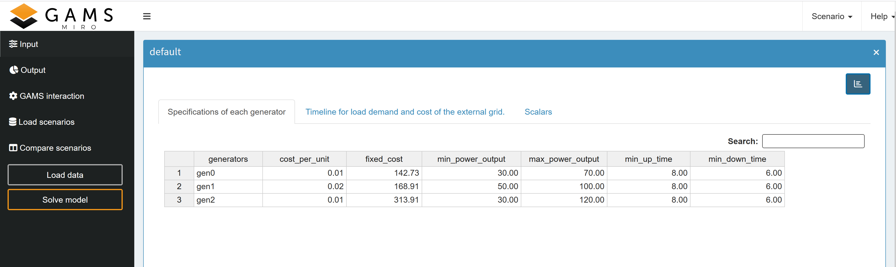
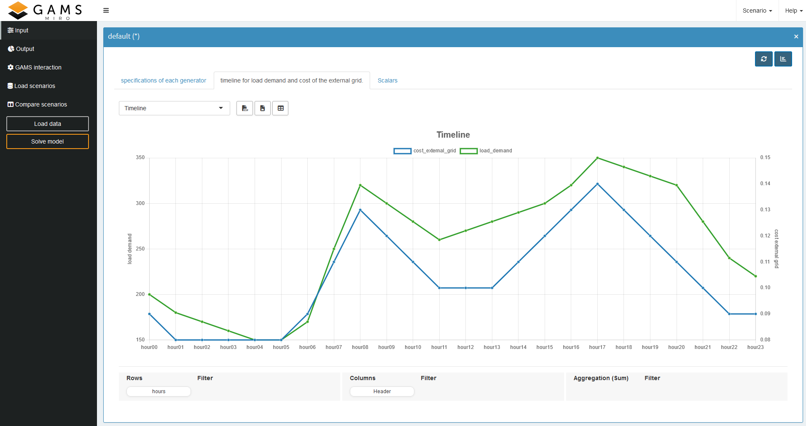
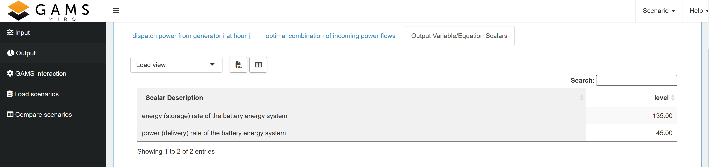
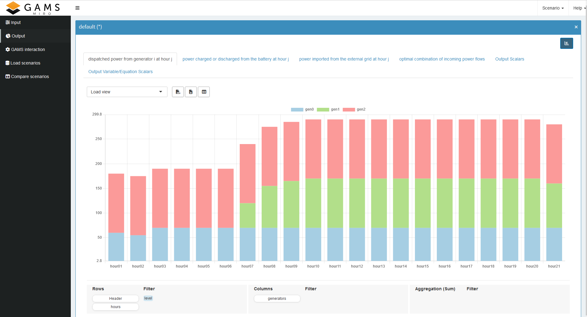
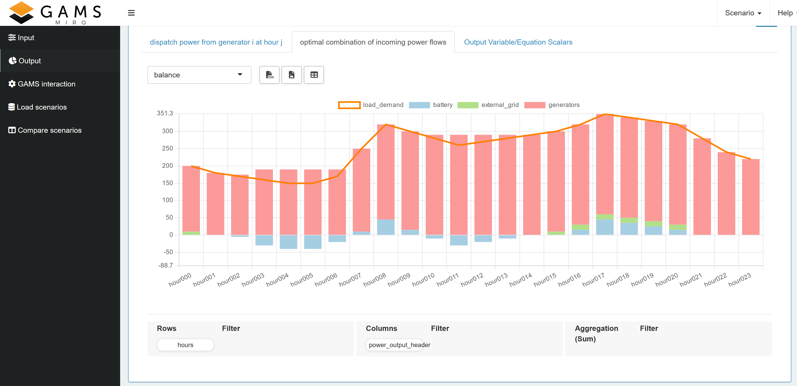

# From GAMSPy Model to MIRO App

In this tutorial we will have a look at the many features MIRO offers to generate an application for your optimization problem. This can be done starting with either a GAMS or GAMSPy implementation of your model. In this tutorial we will start with a GAMSPy model, where we will first have to define the input and output of our application. Note that except for the first section where we go through the changes in the model, there is no difference for the MIRO configuration depending on whether you use GAMS or GAMSPy as the modelling language. Then we will look at the visualization options that you can use directly, based only on these input/output definitions. This can already be helpful when implementing the model, as you can quickly plot the output data and check that the results make sense. And if they do not add up, you have a good starting point for where to look for errors. Next we look at the configuration mode. Here you can add a lot of default configurations without having to touch any code. Since the configuration mode options are sometimes not enough, we will then look at adding some custom renderers and custom widgets. Finally, we will look at some more custom additions that you can add to your MIRO application.

## Implement the Model

First you need to implement the model you want to make an application for, using either GAMS or GAMSPy, as mentioned above we will be using GAMSPy. For instructions on what code changes you need to make in GAMS, see the documentation [LINK](https://www.gams.com/miro/model.html#model-adjustments). 

We will look at a "A Battery Energy Storage System (BESS) sizing problem".
This model aims to optimize a city's hourly energy schedule by selecting the most cost-effective combination of energy sources, including the use of a BESS to store low-cost energy during off-peak hours and release it during high-demand periods. By evaluating the storage capacity and discharge rate of various BESS options, the model identifies the configuration that minimizes overall energy costs while reliably meeting demand. We recommend that you have a quick look at the mathematical description in the README.md first, so that we can use the variable names directly. 

**add the model code here so that people can follow along based on the model**

### Input

Let's start with the simpler inputs. As you can see, we have three scalar input parameters. For these we simply need to add the is_miro_input=True option to their parameter definitions.

CODE SNIPPET


For the generator specifications and the time schedule inputs we need to change a bit more. The model depends on two sets, one for the possible generators and one for the hours when the load demand should be met. Since these two sets are not fixed, but are to be part of the input, we first define the records with our default values. GAMS is domain driven, so for our multi-dimensional parameters we also need to specify all the necessary domains. This can be done either by using the Universal Set (https://gamspy.readthedocs.io/en/latest/user/basics/set.html#the-universal-set-as-set-identifier) or by directly specifying all necessary domains, which is generally the preferred method. For a MIRO application, however, the second option is the **only** possible way, since if we want to use this multidimensional parameter as a table in MIRO, it is necessary to already know which columns the table will have. Therefore we define additional sets for the corresponding headers. These header sets should also be used for any GAMS/GAMSPy model.

Now for the additions to make these into MIRO inputs. First we need to set is_miro_input=True again. As we want them to be displayed as tables, we also set is_miro_table=True. Finally, the most important part, we need to set domain_forwarding=[True, False]. This means that we want the domain corresponding to our generator set to be forwarded so that the set elements are taken from the MIRO application. The headers are known and not part of the input, so we set the second element to False.

CODE SNIPPET


We have two parameters dependent on a given hour, load_demand and cost_external_grid, so to have a single source of truth wrt. the hour set we combine them into one parameter. Now we just need to make the same changes as for the generator specifications. 

In this example it is not necessary to do any further calculations based on the input values. But this could easily be done. An example of this can be seen in vrptw. Here we have longitude and latitude values as input, but our model needs the individual distances. So we simply define a new parameter that depends on our MIRO input. You can use any mathematical calculation allowed in Python for this!

CODE SNIPPET

Given the input, we move on to the output.

### Output 

When implementing the model it is useful to set all variables to output with: is_miro_output=True. This way, after solving, you can quickly check what the calculated variable values are and possibly find any remaining errors in the model.

In general, you can make any variable or parameter an MIRO output. Sometimes it makes sense to define parameters as outputs depending on the variables. A simple example of this in our model would be to define individual parameters for the three cost factors we have. This way we can display these values directly in the MIRO application. 

CODE SNIPPET
```python
import os
# asd
```

In our example, we also want to combine the power variables with the load demand input into one output parameter. This will help us later to show directly that the sum of the powers equals the load demand.

CODE SNIPPET

**again add the full updated gamspy code**

Now you can launch MIRO and have your first version of a fully interactive modelling application!

**maybe link to miro download at the beginning or here?**

BASH SNIPPET

After starting MIRO, your application should look like this:

change this image to one without data
<div align="center">  </div>


## Rapid Prototyping

Now that we have our first MIRO application, let's see what kind of interaction we have right from the start. 

### Input

At first the input parameters are empty, if you click on *Load data* you have the option to load the default values specified by the records option in the GAMSPy code.

If the input parameters are correctly defined, you can now change the input and *Solve model* to obtain the solution for a different set of input values. 

Even at the input stage, it can sometimes be helpful to visualize the data to check for inconsistencies, e.g. that the load demand is never negative and should probably increase during the day and decrease at night, as should the cost of the external grid.

To do this you need to toggle the view in the top right corner by clicking on the three lines **maybe add the icon**. Here you can filter, aggregate and pivot the data. It is also possible to directly use different chart types to visualize the data, this is done with [Pivot Table](https://www.gams.com/miro/charts.html#pivot-chart).

Here we pivoted the headers and selected line graphs. As the values for load_demand and cost_external_grid are not in the same dimension, the direct result is not very helpful as it appears that cost_external_grid is always zero. To make this clearer, we add a second y-axis. This is done by first setting the display type to *Line Chart* and then clicking on the **plus icon** to add a new view. Here you can go to the *Second Axis* tab and select which series to plot in relation to it. You can also add a title and label for the axis. When you are happy with the result, save the view and press the **table icon** to activate the [Presentation Mode](https://www.gams.com/miro/charts.html#presentation-mode).

You should end up with something like this:


<div align="center">  </div>


### Output

When implementing the model, the output is definitely more interesting than the input, so lets see what we can do here. 

For scalar output values, the visualization is very straightforward, simply displaying them in a table under a combined tap:

<div align="center">  </div>

But we can do a lot more with the pivot tool. We might be interested to see which generator provides how much of the total power at what time. To do this we simply go to our output variable which contains the power values of the generators. Here we simply pivot by generator and filter the level value. Then we just need to select the Stacked Bar Chart and we end up with this:

<div align="center">  </div>

Now we can go back and see that *gen0* is the cheapest generator, but it also has the smallest maximum power output, so it needs help to provide full load demand, and apparently, even though the fixed cost of *gen2* is almost double, the generator has to produce so much power that its cheaper unit cost outweighs this. So it checks out. We can also make sure that the minimum up and down times are met. Finally, we can check that each generator, if active, is always within its permitted limits. If we find that one of these constraints is not being met, we immediately know which constraint in the model code we need to take a second look at.


Let us look at another example. Remember that in the model we combined all the power values with our given load demand into one parameter. By looking at this, we can see if the load demand is actually being met and which source contributed to it at each hour. If we were to use the Stacked Bar Chart again, we would not be able to easily compare the amount of load demand with the sum of the power sources. To do this, we change the type back to Stacked Bar Chart and then click the **plus icon to add a new view. Under the *Combo Chart* tab we can specify that we want the load demand to be displayed as a line chart and that it should not be included in the stack. You should end up with the following image:

<div align="center">  </div>


Here we can immediately see that the load demand is always exactly met. The only exception is when the BESS is being charged. We can see that the blue bar is always negative when the input power is higher than the load demand. This is another good check to see if all our constraints are met and if the results are logical.

You can do similar visualizations for the power from the battery and the external grid to check that their constraints are also being met. Hopefully you now have a better understanding of the powerful Pivot Tool and how to use it to check your implementation directly.

## Config Mode
(No coding necessary)

Set Title, Logo, ReadMe
make the views that seemed useful during rapid prototyping into the default
for scalars add sliders
Objective value (cost) as value box (scalar output Parameter)

if multiple views exist can combine them in Dashboard
think of KPI, make scalar Parameters for them
-> only need to touch json files!!
-> maybe gif of Dashboard?

make a custom log directly in the GAMSPy code
-> especially good for data validation

## Fine Tuning with Custom Code

custom widget for time input, directly update the graph

small custom renderer for cumsum(battery_power) to get the storage at every time 
-> add this to the dashboard

custom renderer -> sankey diagram

## Further Possible Additions

custom export -> to database or/and pdf
custom import -> time data from database (possible updates regularly)
deploy -> Miroserver
 

